# UC-001: 회원가입 & 역할선택 - 모듈화 설계

## 개요

### 필요 모듈 목록

#### Backend Layer

1. **src/features/auth/backend/schema.ts**
   - 회원가입 요청/응답 Zod 스키마 정의
   - SignupRequestSchema, SignupResponseSchema
   - 클라이언트 측에서 재사용 가능

2. **src/features/auth/backend/error.ts**
   - 회원가입 관련 에러 코드 정의
   - EMAIL_ALREADY_EXISTS, INVALID_PHONE_FORMAT, TERMS_NOT_AGREED 등

3. **src/features/auth/backend/service.ts**
   - 회원가입 비즈니스 로직
   - createUserWithProfile 함수: Supabase Auth 계정 생성 + profiles 테이블 삽입
   - 입력값 유효성 검사, 이메일 중복 체크, 트랜잭션 처리

4. **src/features/auth/backend/route.ts**
   - POST /api/auth/signup 엔드포인트
   - 요청 파싱, 서비스 호출, 응답 반환

#### Frontend Layer

5. **src/features/auth/components/signup-form.tsx**
   - 회원가입 폼 UI 컴포넌트
   - react-hook-form + zod 기반 폼 유효성 검사
   - 이름, 휴대폰번호, 이메일, 비밀번호, 역할 선택, 약관 동의

6. **src/features/auth/hooks/useSignupMutation.ts**
   - React Query useMutation 훅
   - POST /api/auth/signup 호출
   - 성공 시 역할별 온보딩 페이지로 리다이렉트

7. **src/features/auth/lib/dto.ts**
   - Backend schema 재노출 (클라이언트에서 사용)

8. **src/features/auth/lib/validation.ts**
   - 휴대폰번호 형식 검증 유틸
   - 이메일 형식 검증 유틸 (zod와 보완적 사용)

#### Shared Layer

9. **src/lib/validation/phone.ts** (optional, 공통 유틸)
   - 휴대폰번호 정규식 검증 함수
   - 다른 feature에서도 재사용 가능

#### Page Layer

10. **src/app/signup/page.tsx** (기존 파일 개선)
    - SignupForm 컴포넌트 통합
    - 인증된 사용자는 대시보드로 자동 리다이렉트

#### Configuration

11. **src/backend/hono/app.ts** (수정)
    - registerAuthRoutes(app) 등록

---

## Diagram

```mermaid
graph TB
    subgraph Frontend
        A[SignupPage<br>/app/signup/page.tsx] --> B[SignupForm<br>/features/auth/components/signup-form.tsx]
        B --> C[useSignupMutation<br>/features/auth/hooks/useSignupMutation.ts]
        C --> D[apiClient<br>/lib/remote/api-client.ts]
    end

    subgraph Backend
        D -->|POST /api/auth/signup| E[AuthRoute<br>/features/auth/backend/route.ts]
        E --> F[SignupRequestSchema<br>/features/auth/backend/schema.ts]
        E --> G[createUserWithProfile<br>/features/auth/backend/service.ts]
        G --> H[Supabase Client<br>/backend/supabase/client.ts]
        H --> I[(Supabase Auth)]
        H --> J[(profiles table)]
        G -.validation error.-> K[AuthErrorCodes<br>/features/auth/backend/error.ts]
        E --> L[respond<br>/backend/http/response.ts]
    end

    subgraph Shared
        B --> M[Phone Validation<br>/lib/validation/phone.ts]
        F --> M
        C --> N[DTO Re-export<br>/features/auth/lib/dto.ts]
    end

    L -->|200 OK / 4xx Error| D
    C -->|Success| O[Redirect to Onboarding<br>/advertiser or /influencer]
    C -->|Error| B
```



---

## Implementation Plan

### 1. Backend Schema (`src/features/auth/backend/schema.ts`)

#### 구현 내용
- **SignupRequestSchema**: 회원가입 요청 바디 스키마
  - name: string (1~100자)
  - phone: string (휴대폰번호 형식)
  - email: string (이메일 형식)
  - password: string (최소 8자)
  - role: 'advertiser' | 'influencer'
  - termsAgreed: boolean (true만 허용)

- **SignupResponseSchema**: 회원가입 응답 스키마
  - userId: UUID
  - email: string
  - role: 'advertiser' | 'influencer'
  - emailSent: boolean

#### Unit Test Cases
```typescript
describe('SignupRequestSchema', () => {
  it('유효한 광고주 회원가입 요청을 파싱한다', () => {
    const input = {
      name: '홍길동',
      phone: '010-1234-5678',
      email: 'hong@example.com',
      password: 'password123',
      role: 'advertiser',
      termsAgreed: true,
    };
    const result = SignupRequestSchema.safeParse(input);
    expect(result.success).toBe(true);
  });

  it('약관 미동의 시 실패한다', () => {
    const input = { ...validInput, termsAgreed: false };
    const result = SignupRequestSchema.safeParse(input);
    expect(result.success).toBe(false);
  });

  it('잘못된 이메일 형식 시 실패한다', () => {
    const input = { ...validInput, email: 'invalid-email' };
    const result = SignupRequestSchema.safeParse(input);
    expect(result.success).toBe(false);
  });

  it('역할이 advertiser 또는 influencer가 아니면 실패한다', () => {
    const input = { ...validInput, role: 'admin' };
    const result = SignupRequestSchema.safeParse(input);
    expect(result.success).toBe(false);
  });

  it('비밀번호가 8자 미만이면 실패한다', () => {
    const input = { ...validInput, password: 'short' };
    const result = SignupRequestSchema.safeParse(input);
    expect(result.success).toBe(false);
  });
});
```

---

### 2. Backend Error Codes (`src/features/auth/backend/error.ts`)

#### 구현 내용
```typescript
export const authErrorCodes = {
  emailAlreadyExists: 'EMAIL_ALREADY_EXISTS',
  invalidPhoneFormat: 'INVALID_PHONE_FORMAT',
  termsNotAgreed: 'TERMS_NOT_AGREED',
  authCreationFailed: 'AUTH_CREATION_FAILED',
  profileCreationFailed: 'PROFILE_CREATION_FAILED',
  validationError: 'VALIDATION_ERROR',
} as const;

export type AuthServiceError = (typeof authErrorCodes)[keyof typeof authErrorCodes];
```

---

### 3. Backend Service (`src/features/auth/backend/service.ts`)

#### 구현 내용
- **createUserWithProfile** 함수
  - Supabase Auth signUp 호출
  - 성공 시 profiles 테이블에 INSERT
  - 이메일 인증 메일 자동 발송 (Supabase 기본 동작)
  - 에러 핸들링: 이메일 중복, Auth 실패, DB 삽입 실패

#### Unit Test Cases
```typescript
describe('createUserWithProfile', () => {
  it('유효한 요청으로 사용자와 프로필을 생성한다', async () => {
    const supabaseMock = createSupabaseMock();
    const input = {
      name: '홍길동',
      phone: '010-1234-5678',
      email: 'hong@example.com',
      password: 'password123',
      role: 'advertiser',
      termsAgreed: true,
    };

    const result = await createUserWithProfile(supabaseMock, input);

    expect(result.ok).toBe(true);
    expect(result.data.userId).toBeDefined();
    expect(result.data.role).toBe('advertiser');
  });

  it('이메일이 이미 존재하면 EMAIL_ALREADY_EXISTS 반환', async () => {
    const supabaseMock = createSupabaseMockWithDuplicateEmail();
    const result = await createUserWithProfile(supabaseMock, input);

    expect(result.ok).toBe(false);
    expect(result.error.code).toBe(authErrorCodes.emailAlreadyExists);
  });

  it('Auth 생성 실패 시 AUTH_CREATION_FAILED 반환', async () => {
    const supabaseMock = createSupabaseMockWithAuthError();
    const result = await createUserWithProfile(supabaseMock, input);

    expect(result.ok).toBe(false);
    expect(result.error.code).toBe(authErrorCodes.authCreationFailed);
  });

  it('프로필 삽입 실패 시 PROFILE_CREATION_FAILED 반환', async () => {
    const supabaseMock = createSupabaseMockWithProfileInsertError();
    const result = await createUserWithProfile(supabaseMock, input);

    expect(result.ok).toBe(false);
    expect(result.error.code).toBe(authErrorCodes.profileCreationFailed);
  });
});
```

---

### 4. Backend Route (`src/features/auth/backend/route.ts`)

#### 구현 내용
- POST /api/auth/signup
  - 요청 바디를 SignupRequestSchema로 파싱
  - createUserWithProfile 서비스 호출
  - 성공 시 200 OK + SignupResponse
  - 실패 시 4xx/5xx + ErrorResult

#### Unit Test Cases (Integration Test)
```typescript
describe('POST /api/auth/signup', () => {
  it('유효한 요청으로 회원가입 성공', async () => {
    const response = await request(app).post('/api/auth/signup').send({
      name: '홍길동',
      phone: '010-1234-5678',
      email: 'hong@example.com',
      password: 'password123',
      role: 'advertiser',
      termsAgreed: true,
    });

    expect(response.status).toBe(200);
    expect(response.body.userId).toBeDefined();
    expect(response.body.role).toBe('advertiser');
  });

  it('약관 미동의 시 400 에러 반환', async () => {
    const response = await request(app).post('/api/auth/signup').send({
      ...validPayload,
      termsAgreed: false,
    });

    expect(response.status).toBe(400);
    expect(response.body.error.code).toBe('VALIDATION_ERROR');
  });

  it('이메일 중복 시 409 에러 반환', async () => {
    // 첫 번째 회원가입
    await request(app).post('/api/auth/signup').send(validPayload);

    // 동일 이메일로 재시도
    const response = await request(app).post('/api/auth/signup').send(validPayload);

    expect(response.status).toBe(409);
    expect(response.body.error.code).toBe(authErrorCodes.emailAlreadyExists);
  });
});
```

---

### 5. Frontend Component (`src/features/auth/components/signup-form.tsx`)

#### 구현 내용
- react-hook-form + zod 기반 폼
- 입력 필드:
  - name (Text Input)
  - phone (Text Input, placeholder: 010-0000-0000)
  - email (Email Input)
  - password (Password Input)
  - confirmPassword (Password Input)
  - role (Radio Group: 광고주 / 인플루언서)
  - termsAgreed (Checkbox)
- 클라이언트 측 실시간 유효성 검사
- useSignupMutation 훅 사용
- 제출 중 버튼 disabled 처리
- 에러 메시지 표시 (toast 또는 inline)

#### QA Sheet
| Test Case | Input | Expected Output | Pass/Fail |
|-----------|-------|-----------------|-----------|
| 모든 필드 유효 입력 | name: "홍길동", phone: "010-1234-5678", email: "hong@test.com", password: "password123", role: "advertiser", termsAgreed: true | 회원가입 성공, 광고주 온보딩 페이지 이동 | |
| 이름 미입력 | name: "" | "이름을 입력해주세요" 에러 표시 | |
| 휴대폰번호 형식 오류 | phone: "123456" | "올바른 휴대폰번호 형식이 아닙니다" 에러 표시 | |
| 이메일 형식 오류 | email: "invalid" | "올바른 이메일 형식이 아닙니다" 에러 표시 | |
| 비밀번호 확인 불일치 | password: "pass123", confirmPassword: "pass456" | "비밀번호가 일치하지 않습니다" 에러 표시 | |
| 역할 미선택 | role: undefined | "역할을 선택해주세요" 에러 표시 | |
| 약관 미동의 | termsAgreed: false | "약관에 동의해주세요" 에러 표시 | |
| 이메일 중복 | 이미 존재하는 이메일 | "이미 사용 중인 이메일입니다" 토스트 표시 | |
| 서버 오류 | 서버 500 에러 | "일시적인 오류가 발생했습니다" 토스트 표시 | |
| 인플루언서 선택 | role: "influencer" | 회원가입 성공, 인플루언서 온보딩 페이지 이동 | |

---

### 6. Frontend Hook (`src/features/auth/hooks/useSignupMutation.ts`)

#### 구현 내용
- useMutation 사용
- mutationFn: POST /api/auth/signup via apiClient
- onSuccess: 역할별 리다이렉트 (/advertiser-onboarding 또는 /influencer-onboarding)
- onError: 에러 메시지 추출 및 toast 표시
- 이메일 인증 안내 메시지 표시

#### Unit Test Cases (React Testing Library + MSW)
```typescript
describe('useSignupMutation', () => {
  it('회원가입 성공 시 onSuccess 콜백 호출', async () => {
    const { result } = renderHook(() => useSignupMutation(), { wrapper: QueryWrapper });

    act(() => {
      result.current.mutate({
        name: '홍길동',
        phone: '010-1234-5678',
        email: 'hong@test.com',
        password: 'password123',
        role: 'advertiser',
        termsAgreed: true,
      });
    });

    await waitFor(() => expect(result.current.isSuccess).toBe(true));
    expect(result.current.data.role).toBe('advertiser');
  });

  it('서버 에러 시 onError 콜백 호출', async () => {
    server.use(
      rest.post('/api/auth/signup', (req, res, ctx) => {
        return res(ctx.status(500), ctx.json({ error: { message: 'Internal Server Error' } }));
      })
    );

    const { result } = renderHook(() => useSignupMutation(), { wrapper: QueryWrapper });

    act(() => {
      result.current.mutate(validInput);
    });

    await waitFor(() => expect(result.current.isError).toBe(true));
    expect(result.current.error.message).toContain('Internal Server Error');
  });
});
```

---

### 7. Frontend DTO (`src/features/auth/lib/dto.ts`)

#### 구현 내용
```typescript
export {
  SignupRequestSchema,
  SignupResponseSchema,
  type SignupRequest,
  type SignupResponse,
} from '@/features/auth/backend/schema';
```

---

### 8. Frontend Validation Utility (`src/features/auth/lib/validation.ts`)

#### 구현 내용
```typescript
export const isValidPhoneNumber = (phone: string): boolean => {
  const phoneRegex = /^010-\d{4}-\d{4}$/;
  return phoneRegex.test(phone);
};

export const formatPhoneNumber = (phone: string): string => {
  // 010-0000-0000 형식으로 자동 포맷팅
  const digits = phone.replace(/\D/g, '');
  if (digits.length === 11) {
    return `${digits.slice(0, 3)}-${digits.slice(3, 7)}-${digits.slice(7)}`;
  }
  return phone;
};
```

#### Unit Test Cases
```typescript
describe('isValidPhoneNumber', () => {
  it('유효한 휴대폰번호 형식', () => {
    expect(isValidPhoneNumber('010-1234-5678')).toBe(true);
  });

  it('하이픈 없는 형식은 실패', () => {
    expect(isValidPhoneNumber('01012345678')).toBe(false);
  });

  it('010으로 시작하지 않으면 실패', () => {
    expect(isValidPhoneNumber('011-1234-5678')).toBe(false);
  });
});

describe('formatPhoneNumber', () => {
  it('11자리 숫자를 010-0000-0000 형식으로 변환', () => {
    expect(formatPhoneNumber('01012345678')).toBe('010-1234-5678');
  });

  it('이미 포맷된 번호는 그대로 반환', () => {
    expect(formatPhoneNumber('010-1234-5678')).toBe('010-1234-5678');
  });
});
```

---

### 9. Shared Utility (Optional) (`src/lib/validation/phone.ts`)

#### 구현 내용
- auth feature의 validation.ts와 동일한 로직
- 다른 feature에서도 재사용 가능하도록 shared layer에 배치
- 필요 시 auth feature에서 import하여 사용

---

### 10. Signup Page (`src/app/signup/page.tsx`)

#### 구현 내용
- 기존 page.tsx를 개선하여 SignupForm 컴포넌트 통합
- useCurrentUser 훅으로 인증 상태 확인
- 이미 인증된 사용자는 dashboard로 리다이렉트
- SignupForm을 중앙에 배치하고 스타일링

#### QA Sheet
| Test Case | Condition | Expected Behavior | Pass/Fail |
|-----------|-----------|-------------------|-----------|
| 비인증 사용자 접근 | isAuthenticated: false | SignupForm 렌더링 | |
| 인증된 사용자 접근 | isAuthenticated: true | Dashboard로 리다이렉트 | |
| 회원가입 성공 후 | 광고주 역할 | /advertiser-onboarding으로 리다이렉트 | |
| 회원가입 성공 후 | 인플루언서 역할 | /influencer-onboarding으로 리다이렉트 | |

---

### 11. Hono App Configuration (`src/backend/hono/app.ts`)

#### 구현 내용
- registerAuthRoutes(app) 함수 import 및 등록
- 기존 registerExampleRoutes와 동일한 패턴

```typescript
import { registerAuthRoutes } from '@/features/auth/backend/route';

export const createHonoApp = () => {
  // ... existing code ...

  registerExampleRoutes(app);
  registerAuthRoutes(app); // 추가

  // ... existing code ...
};
```

---

## 구현 순서

1. Backend Schema → Error Codes → Service → Route (순서대로 의존성 고려)
2. Shared Validation Utility (phone.ts)
3. Frontend DTO (re-export)
4. Frontend Validation Utility
5. Frontend Hook (useSignupMutation)
6. Frontend Component (SignupForm)
7. Page Integration (signup/page.tsx)
8. Hono App Configuration

---

## 추가 고려사항

### Rate Limiting
- 향후 Hono 미들웨어로 IP 기반 rate limiting 구현 권장
- 예: 동일 IP에서 5분 내 5회 이상 회원가입 시도 시 차단

### Email Verification Flow
- 현재 Supabase Auth가 자동으로 이메일 인증 메일 발송
- 인증 완료 후 redirect URL 설정 필요 (Supabase Dashboard에서 설정)
- 인증 완료 시 /login 페이지로 이동하도록 유도

### Security
- 비밀번호는 Supabase Auth에서 자동 암호화
- 휴대폰번호는 평문 저장 (향후 마스킹 처리 권장)
- CSRF 토큰은 Next.js API Route에서 자동 처리

### Accessibility
- 폼 필드에 적절한 label 연결 (htmlFor, aria-label)
- 에러 메시지는 role="alert"로 스크린 리더에 알림
- 키보드 네비게이션 지원