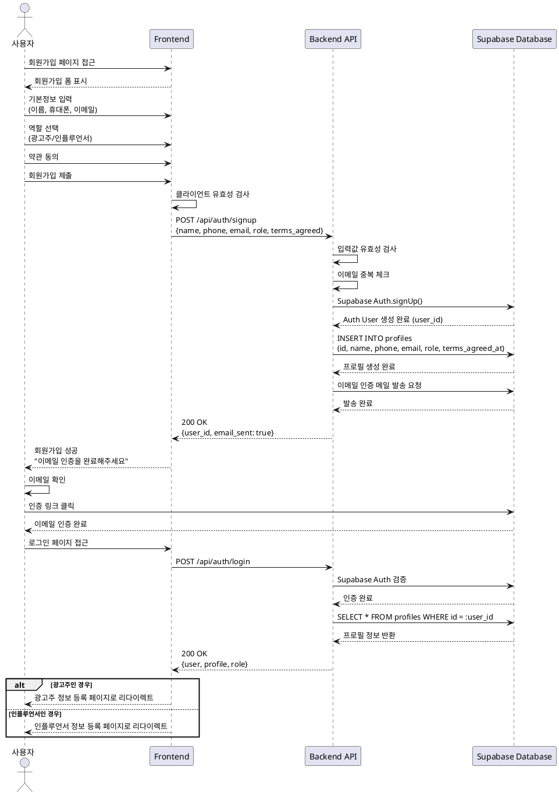

# UC-001: 회원가입 & 역할선택

## Primary Actor

신규 사용자 (광고주 또는 인플루언서)

## Precondition

- 사용자가 회원가입 페이지에 접근
- 유효한 이메일 주소 보유
- 약관 내용 확인 가능

## Trigger

사용자가 회원가입 페이지에서 "회원가입" 버튼 클릭

## Main Scenario

1. 사용자가 회원가입 폼에 접근
2. 사용자가 기본 정보 입력
   - 이름
   - 휴대폰번호
   - 이메일
3. 사용자가 역할 선택 (광고주 / 인플루언서)
4. 사용자가 약관 동의 체크
5. 사용자가 회원가입 제출
6. 시스템이 입력값 유효성 검사 수행
7. 시스템이 Supabase Auth 계정 생성
8. 시스템이 profiles 테이블에 프로필 레코드 생성
9. 시스템이 이메일 인증 메일 발송
10. 사용자가 이메일 인증 완료
11. 시스템이 역할별 온보딩 페이지로 리다이렉트
    - 광고주 → 광고주 정보 등록 페이지
    - 인플루언서 → 인플루언서 정보 등록 페이지

## Edge Cases

### 입력 유효성 오류
- **이메일 중복**: 이미 가입된 이메일인 경우 "이미 사용 중인 이메일입니다" 메시지 표시
- **휴대폰번호 형식 오류**: 올바른 형식 안내 메시지 표시
- **필수 항목 누락**: 해당 필드에 에러 메시지 표시
- **약관 미동의**: 약관 동의 필수 안내

### Auth 생성 실패
- Supabase Auth API 오류 시 "일시적인 오류가 발생했습니다. 잠시 후 다시 시도해주세요" 메시지 표시
- 사용자 입력 데이터는 폼에 보존

### 이메일 인증
- 인증 메일 미수신 시 "재발송" 버튼 제공
- 인증 링크 만료 시 재발송 유도

### 레이트 리밋
- 동일 IP에서 단시간 내 과도한 가입 시도 시 일시적 차단
- "너무 많은 요청이 발생했습니다. 잠시 후 다시 시도해주세요" 메시지 표시

## Business Rules

### BR-001: 필수 입력 항목
- 이름, 휴대폰번호, 이메일, 역할, 약관동의는 필수

### BR-002: 이메일 중복 불가
- 동일 이메일로 중복 가입 불가
- Supabase Auth 레벨에서 중복 차단

### BR-003: 역할 선택 필수
- 회원가입 시 반드시 광고주 또는 인플루언서 중 하나 선택
- 역할은 이후 변경 불가

### BR-004: 이메일 인증 필수
- 이메일 인증 완료 전까지 로그인 불가
- 인증 링크 유효기간: 24시간

### BR-005: 약관 동의 필수
- 서비스 이용약관 동의 필수
- 동의 시각(terms_agreed_at) 기록

### BR-006: 개인정보 보호
- 비밀번호는 Supabase Auth에서 암호화 저장
- 휴대폰번호는 평문 저장 (향후 마스킹 처리 권장)

---

## Sequence Diagram

