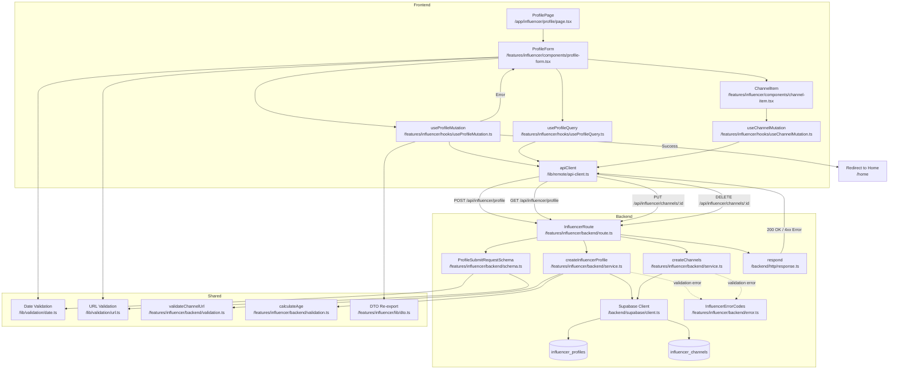

# UC-002: 인플루언서 정보 등록 - 모듈화 설계

## 개요

### 필요 모듈 목록

#### Backend Layer

1. **src/features/influencer/backend/schema.ts**
   - 인플루언서 프로필 등록 요청/응답 Zod 스키마 정의
   - ProfileSubmitRequestSchema, ProfileSubmitResponseSchema
   - ChannelSchema (platform, name, url)
   - 클라이언트 측에서 재사용 가능

2. **src/features/influencer/backend/error.ts**
   - 인플루언서 정보 등록 관련 에러 코드 정의
   - INVALID_BIRTH_DATE, AGE_RESTRICTION, DUPLICATE_CHANNEL, NO_VERIFIED_CHANNEL 등

3. **src/features/influencer/backend/service.ts**
   - 인플루언서 정보 등록 비즈니스 로직
   - createInfluencerProfile: influencer_profiles 테이블 삽입 또는 업데이트
   - createChannels: influencer_channels 테이블에 채널 정보 삽입
   - 생년월일 나이 검증 로직 (만 14세 이상)
   - 채널 URL 패턴 검증 로직
   - 채널 중복 체크

4. **src/features/influencer/backend/route.ts**
   - POST /api/influencer/profile 엔드포인트 (제출/임시저장)
   - GET /api/influencer/profile 엔드포인트 (프로필 조회)
   - PUT /api/influencer/channels/:id 엔드포인트 (채널 편집)
   - DELETE /api/influencer/channels/:id 엔드포인트 (채널 삭제)

5. **src/features/influencer/backend/validation.ts**
   - 채널 URL 패턴 검증 함수
   - validateInstagramUrl, validateYoutubeUrl, validateBlogUrl
   - 생년월일 기반 나이 계산 및 검증 함수

#### Frontend Layer

6. **src/features/influencer/components/profile-form.tsx**
   - 인플루언서 정보 등록 폼 UI 컴포넌트
   - react-hook-form + zod 기반 폼 유효성 검사
   - 생년월일 입력 (Date Picker)
   - 채널 추가/편집/삭제 UI

7. **src/features/influencer/components/channel-item.tsx**
   - 채널 정보 표시 및 편집/삭제 UI 컴포넌트
   - 채널 검증 상태 표시 (pending, verified, failed)

8. **src/features/influencer/hooks/useProfileMutation.ts**
   - React Query useMutation 훅
   - POST /api/influencer/profile 호출 (제출/임시저장)
   - 성공 시 홈 페이지 또는 프로필 페이지로 리다이렉트

9. **src/features/influencer/hooks/useProfileQuery.ts**
   - React Query useQuery 훅
   - GET /api/influencer/profile 호출 (프로필 및 채널 정보 조회)
   - 임시저장된 데이터 복원

10. **src/features/influencer/hooks/useChannelMutation.ts**
    - React Query useMutation 훅
    - PUT /api/influencer/channels/:id (채널 편집)
    - DELETE /api/influencer/channels/:id (채널 삭제)

11. **src/features/influencer/lib/dto.ts**
    - Backend schema 재노출 (클라이언트에서 사용)

12. **src/features/influencer/lib/validation.ts**
    - 프론트엔드 채널 URL 형식 검증 유틸
    - 생년월일 형식 검증 유틸

#### Shared Layer

13. **src/lib/validation/date.ts** (공통 유틸)
    - 생년월일 형식 검증 함수
    - 나이 계산 함수 (만 나이)
    - 다른 feature에서도 재사용 가능

14. **src/lib/validation/url.ts** (공통 유틸)
    - URL 형식 검증 함수
    - 플랫폼별 URL 패턴 검증 함수
    - 다른 feature에서도 재사용 가능

#### Page Layer

15. **src/app/influencer/profile/page.tsx**
    - 인플루언서 정보 등록 페이지
    - ProfileForm 컴포넌트 통합
    - 인증된 인플루언서만 접근 가능

#### Configuration

16. **src/backend/hono/app.ts** (수정)
    - registerInfluencerRoutes(app) 등록

---

## Diagram



---

## Implementation Plan

### 1. Backend Schema (`src/features/influencer/backend/schema.ts`)

#### 구현 내용
- **ChannelSchema**: 채널 정보 스키마
  - platform: 'naver' | 'youtube' | 'instagram' | 'threads'
  - name: string (1~100자)
  - url: string (URL 형식)

- **ProfileSubmitRequestSchema**: 인플루언서 정보 등록 요청 스키마
  - birthDate: string (YYYY-MM-DD 형식)
  - channels: ChannelSchema[] (최소 1개 이상)
  - status: 'draft' | 'submitted' (임시저장/제출)

- **ProfileSubmitResponseSchema**: 인플루언서 정보 등록 응답 스키마
  - profileId: UUID
  - userId: UUID
  - birthDate: string
  - channels: Array<{ id: UUID, status: 'pending' | 'verified' | 'failed' }>
  - profileStatus: 'draft' | 'submitted'

- **ProfileQueryResponseSchema**: 프로필 조회 응답 스키마
  - profile: { id, userId, birthDate, status }
  - channels: Array<{ id, platform, name, url, status }>

#### Unit Test Cases
```typescript
describe('ChannelSchema', () => {
  it('유효한 Instagram 채널 정보를 파싱한다', () => {
    const input = {
      platform: 'instagram',
      name: '내 인스타그램',
      url: 'https://www.instagram.com/username',
    };
    const result = ChannelSchema.safeParse(input);
    expect(result.success).toBe(true);
  });

  it('플랫폼이 허용되지 않은 값이면 실패한다', () => {
    const input = { ...validChannel, platform: 'facebook' };
    const result = ChannelSchema.safeParse(input);
    expect(result.success).toBe(false);
  });

  it('URL 형식이 아니면 실패한다', () => {
    const input = { ...validChannel, url: 'invalid-url' };
    const result = ChannelSchema.safeParse(input);
    expect(result.success).toBe(false);
  });
});

describe('ProfileSubmitRequestSchema', () => {
  it('유효한 제출 요청을 파싱한다', () => {
    const input = {
      birthDate: '1990-01-01',
      channels: [
        {
          platform: 'instagram',
          name: '내 인스타그램',
          url: 'https://www.instagram.com/username',
        },
      ],
      status: 'submitted',
    };
    const result = ProfileSubmitRequestSchema.safeParse(input);
    expect(result.success).toBe(true);
  });

  it('채널이 없으면 실패한다', () => {
    const input = { birthDate: '1990-01-01', channels: [], status: 'submitted' };
    const result = ProfileSubmitRequestSchema.safeParse(input);
    expect(result.success).toBe(false);
  });

  it('생년월일 형식이 올바르지 않으면 실패한다', () => {
    const input = { ...validInput, birthDate: '90/01/01' };
    const result = ProfileSubmitRequestSchema.safeParse(input);
    expect(result.success).toBe(false);
  });
});
```

---

### 2. Backend Error Codes (`src/features/influencer/backend/error.ts`)

#### 구현 내용
```typescript
export const influencerErrorCodes = {
  invalidBirthDate: 'INVALID_BIRTH_DATE',
  ageRestriction: 'AGE_RESTRICTION',
  duplicateChannel: 'DUPLICATE_CHANNEL',
  noVerifiedChannel: 'NO_VERIFIED_CHANNEL',
  profileNotFound: 'PROFILE_NOT_FOUND',
  channelNotFound: 'CHANNEL_NOT_FOUND',
  invalidChannelUrl: 'INVALID_CHANNEL_URL',
  profileCreationFailed: 'PROFILE_CREATION_FAILED',
  channelCreationFailed: 'CHANNEL_CREATION_FAILED',
  validationError: 'VALIDATION_ERROR',
  unauthorizedAccess: 'UNAUTHORIZED_ACCESS',
} as const;

export type InfluencerServiceError = (typeof influencerErrorCodes)[keyof typeof influencerErrorCodes];
```

---

### 3. Backend Validation (`src/features/influencer/backend/validation.ts`)

#### 구현 내용
- **calculateAge**: 생년월일 기반 만 나이 계산
- **validateAge**: 만 14세 이상 검증
- **validateInstagramUrl**: Instagram URL 패턴 검증
- **validateYoutubeUrl**: YouTube URL 패턴 검증
- **validateBlogUrl**: 블로그 URL 검증 (유효한 HTTP(S) URL)
- **validateChannelUrl**: 플랫폼별 URL 패턴 검증 통합 함수

#### Unit Test Cases
```typescript
describe('calculateAge', () => {
  it('만 나이를 정확하게 계산한다', () => {
    const birthDate = '1990-01-01';
    const age = calculateAge(birthDate);
    expect(age).toBeGreaterThanOrEqual(34);
  });

  it('생일이 지나지 않았으면 나이가 1 적다', () => {
    const today = new Date();
    const nextDay = new Date(today);
    nextDay.setDate(today.getDate() + 1);
    const birthDate = `${today.getFullYear() - 20}-${String(nextDay.getMonth() + 1).padStart(2, '0')}-${String(nextDay.getDate()).padStart(2, '0')}`;
    const age = calculateAge(birthDate);
    expect(age).toBe(19);
  });
});

describe('validateAge', () => {
  it('만 14세 이상이면 true 반환', () => {
    const birthDate = '2000-01-01';
    expect(validateAge(birthDate)).toBe(true);
  });

  it('만 14세 미만이면 false 반환', () => {
    const today = new Date();
    const birthDate = `${today.getFullYear() - 13}-${String(today.getMonth() + 1).padStart(2, '0')}-${String(today.getDate()).padStart(2, '0')}`;
    expect(validateAge(birthDate)).toBe(false);
  });
});

describe('validateInstagramUrl', () => {
  it('유효한 Instagram URL', () => {
    expect(validateInstagramUrl('https://www.instagram.com/username')).toBe(true);
  });

  it('잘못된 Instagram URL', () => {
    expect(validateInstagramUrl('https://www.youtube.com/@channel')).toBe(false);
  });
});

describe('validateYoutubeUrl', () => {
  it('유효한 YouTube URL (@channel)', () => {
    expect(validateYoutubeUrl('https://www.youtube.com/@channel')).toBe(true);
  });

  it('유효한 YouTube URL (/c/channel)', () => {
    expect(validateYoutubeUrl('https://www.youtube.com/c/channel')).toBe(true);
  });

  it('잘못된 YouTube URL', () => {
    expect(validateYoutubeUrl('https://www.instagram.com/username')).toBe(false);
  });
});

describe('validateChannelUrl', () => {
  it('플랫폼별 URL 검증 통합', () => {
    expect(validateChannelUrl('instagram', 'https://www.instagram.com/username')).toBe(true);
    expect(validateChannelUrl('youtube', 'https://www.youtube.com/@channel')).toBe(true);
    expect(validateChannelUrl('naver', 'https://blog.naver.com/userid')).toBe(true);
    expect(validateChannelUrl('threads', 'https://www.threads.net/@username')).toBe(true);
  });

  it('플랫폼과 URL이 일치하지 않으면 false', () => {
    expect(validateChannelUrl('instagram', 'https://www.youtube.com/@channel')).toBe(false);
  });
});
```

---

### 4. Backend Service (`src/features/influencer/backend/service.ts`)

#### 구현 내용
- **createInfluencerProfile** 함수
  - influencer_profiles 테이블에 INSERT 또는 UPDATE
  - 생년월일 나이 검증 (만 14세 이상)
  - user_id 기반 기존 프로필 확인
  - status: 'draft' (임시저장) | 'submitted' (제출)

- **createChannels** 함수
  - influencer_channels 테이블에 INSERT
  - 채널 URL 패턴 검증
  - 채널 중복 체크 (동일 user_id + channel_url)
  - status: 'pending' (검증대기) 기본값

- **getInfluencerProfile** 함수
  - user_id 기반 프로필 및 채널 정보 조회
  - JOIN influencer_profiles + influencer_channels

- **updateChannel** 함수
  - 채널 정보 업데이트
  - 수정 시 status를 'pending'으로 초기화

- **deleteChannel** 함수
  - 채널 삭제
  - 최소 1개 채널 유지 검증

#### Unit Test Cases
```typescript
describe('createInfluencerProfile', () => {
  it('유효한 요청으로 인플루언서 프로필 생성', async () => {
    const supabaseMock = createSupabaseMock();
    const input = {
      userId: 'user-uuid',
      birthDate: '1990-01-01',
      channels: [
        { platform: 'instagram', name: '내 인스타', url: 'https://www.instagram.com/username' },
      ],
      status: 'submitted',
    };

    const result = await createInfluencerProfile(supabaseMock, input);

    expect(result.ok).toBe(true);
    expect(result.data.profileId).toBeDefined();
  });

  it('만 14세 미만이면 AGE_RESTRICTION 반환', async () => {
    const supabaseMock = createSupabaseMock();
    const today = new Date();
    const birthDate = `${today.getFullYear() - 13}-01-01`;
    const input = { ...validInput, birthDate };

    const result = await createInfluencerProfile(supabaseMock, input);

    expect(result.ok).toBe(false);
    expect(result.error.code).toBe(influencerErrorCodes.ageRestriction);
  });

  it('중복 채널 URL이 있으면 DUPLICATE_CHANNEL 반환', async () => {
    const supabaseMock = createSupabaseMockWithDuplicateChannel();
    const result = await createInfluencerProfile(supabaseMock, validInput);

    expect(result.ok).toBe(false);
    expect(result.error.code).toBe(influencerErrorCodes.duplicateChannel);
  });

  it('잘못된 채널 URL이면 INVALID_CHANNEL_URL 반환', async () => {
    const input = {
      ...validInput,
      channels: [{ platform: 'instagram', name: '내 인스타', url: 'invalid-url' }],
    };
    const result = await createInfluencerProfile(createSupabaseMock(), input);

    expect(result.ok).toBe(false);
    expect(result.error.code).toBe(influencerErrorCodes.invalidChannelUrl);
  });
});

describe('getInfluencerProfile', () => {
  it('프로필과 채널 정보 조회 성공', async () => {
    const supabaseMock = createSupabaseMock();
    const result = await getInfluencerProfile(supabaseMock, 'user-uuid');

    expect(result.ok).toBe(true);
    expect(result.data.profile).toBeDefined();
    expect(result.data.channels).toHaveLength(1);
  });

  it('프로필이 없으면 PROFILE_NOT_FOUND 반환', async () => {
    const supabaseMock = createSupabaseMockWithNoProfile();
    const result = await getInfluencerProfile(supabaseMock, 'user-uuid');

    expect(result.ok).toBe(false);
    expect(result.error.code).toBe(influencerErrorCodes.profileNotFound);
  });
});

describe('deleteChannel', () => {
  it('채널 삭제 성공', async () => {
    const supabaseMock = createSupabaseMock();
    const result = await deleteChannel(supabaseMock, 'channel-uuid', 'user-uuid');

    expect(result.ok).toBe(true);
  });

  it('마지막 채널이면 삭제 불가', async () => {
    const supabaseMock = createSupabaseMockWithOneChannel();
    const result = await deleteChannel(supabaseMock, 'channel-uuid', 'user-uuid');

    expect(result.ok).toBe(false);
    expect(result.error.code).toBe(influencerErrorCodes.noVerifiedChannel);
  });
});
```

---

### 5. Backend Route (`src/features/influencer/backend/route.ts`)

#### 구현 내용
- POST /api/influencer/profile
  - 요청 바디를 ProfileSubmitRequestSchema로 파싱
  - createInfluencerProfile + createChannels 서비스 호출
  - 성공 시 200 OK + ProfileSubmitResponse
  - 실패 시 4xx/5xx + ErrorResult

- GET /api/influencer/profile
  - user_id 기반 프로필 조회
  - getInfluencerProfile 서비스 호출
  - 성공 시 200 OK + ProfileQueryResponse
  - 프로필 없으면 404

- PUT /api/influencer/channels/:id
  - 채널 정보 업데이트
  - updateChannel 서비스 호출
  - 성공 시 200 OK

- DELETE /api/influencer/channels/:id
  - 채널 삭제
  - deleteChannel 서비스 호출
  - 성공 시 204 No Content

#### Unit Test Cases (Integration Test)
```typescript
describe('POST /api/influencer/profile', () => {
  it('유효한 요청으로 프로필 생성 성공', async () => {
    const response = await request(app).post('/api/influencer/profile').send({
      birthDate: '1990-01-01',
      channels: [
        { platform: 'instagram', name: '내 인스타', url: 'https://www.instagram.com/username' },
      ],
      status: 'submitted',
    });

    expect(response.status).toBe(200);
    expect(response.body.profileId).toBeDefined();
  });

  it('만 14세 미만이면 400 에러 반환', async () => {
    const today = new Date();
    const birthDate = `${today.getFullYear() - 13}-01-01`;
    const response = await request(app).post('/api/influencer/profile').send({
      ...validPayload,
      birthDate,
    });

    expect(response.status).toBe(400);
    expect(response.body.error.code).toBe(influencerErrorCodes.ageRestriction);
  });

  it('채널 URL이 올바르지 않으면 400 에러 반환', async () => {
    const response = await request(app).post('/api/influencer/profile').send({
      ...validPayload,
      channels: [{ platform: 'instagram', name: '내 인스타', url: 'invalid-url' }],
    });

    expect(response.status).toBe(400);
    expect(response.body.error.code).toBe(influencerErrorCodes.invalidChannelUrl);
  });
});

describe('GET /api/influencer/profile', () => {
  it('프로필 조회 성공', async () => {
    const response = await request(app).get('/api/influencer/profile');

    expect(response.status).toBe(200);
    expect(response.body.profile).toBeDefined();
    expect(response.body.channels).toBeInstanceOf(Array);
  });

  it('프로필이 없으면 404 반환', async () => {
    const response = await request(app).get('/api/influencer/profile');

    expect(response.status).toBe(404);
    expect(response.body.error.code).toBe(influencerErrorCodes.profileNotFound);
  });
});

describe('DELETE /api/influencer/channels/:id', () => {
  it('채널 삭제 성공', async () => {
    const response = await request(app).delete('/api/influencer/channels/channel-uuid');

    expect(response.status).toBe(204);
  });

  it('마지막 채널이면 삭제 불가', async () => {
    const response = await request(app).delete('/api/influencer/channels/channel-uuid');

    expect(response.status).toBe(400);
    expect(response.body.error.code).toBe(influencerErrorCodes.noVerifiedChannel);
  });
});
```

---

### 6. Frontend Component (`src/features/influencer/components/profile-form.tsx`)

#### 구현 내용
- react-hook-form + zod 기반 폼
- 입력 필드:
  - birthDate (Date Picker, YYYY-MM-DD)
  - channels (동적 배열)
    - platform (Select: Naver / YouTube / Instagram / Threads)
    - name (Text Input)
    - url (Text Input)
  - "채널 추가" 버튼
  - "임시저장" / "제출" 버튼
- 클라이언트 측 실시간 유효성 검사
- useProfileMutation 훅 사용
- useProfileQuery 훅으로 기존 데이터 복원 (임시저장)
- 제출 중 버튼 disabled 처리
- 에러 메시지 표시 (toast 또는 inline)

#### QA Sheet
| Test Case | Input | Expected Output | Pass/Fail |
|-----------|-------|-----------------|-----------|
| 모든 필드 유효 입력 | birthDate: "1990-01-01", channels: [{ platform: "instagram", name: "내 인스타", url: "https://www.instagram.com/username" }], status: "submitted" | 프로필 등록 성공, 홈 페이지 이동 | |
| 생년월일 미입력 | birthDate: "" | "생년월일을 입력해주세요" 에러 표시 | |
| 만 14세 미만 | birthDate: "2015-01-01" | "만 14세 이상만 가입 가능합니다" 에러 표시 | |
| 채널 미입력 | channels: [] | "최소 1개 이상의 채널을 등록해주세요" 에러 표시 | |
| 채널 URL 형식 오류 | url: "invalid-url" | "올바른 URL 형식을 입력해주세요" 에러 표시 | |
| Instagram URL 불일치 | platform: "instagram", url: "https://www.youtube.com/@channel" | "올바른 Instagram URL이 아닙니다" 에러 표시 | |
| 중복 채널 URL | 동일한 URL 2개 입력 | "이미 등록된 채널입니다" 에러 표시 | |
| 임시저장 | status: "draft" | 임시저장 성공, "임시저장되었습니다" 토스트 표시 | |
| 제출 후 재진입 | 기존 프로필 존재 | 기존 데이터 자동 복원 | |
| 채널 추가 | "채널 추가" 버튼 클릭 | 새 채널 입력 필드 추가 | |
| 채널 삭제 | 채널 삭제 버튼 클릭 | 해당 채널 제거 | |

---

### 7. Frontend Component (`src/features/influencer/components/channel-item.tsx`)

#### 구현 내용
- 채널 정보 표시
  - platform 아이콘 + 채널명 + URL
  - 검증 상태 표시 (pending: 검증대기, verified: 검증완료, failed: 검증실패)
- 편집 버튼
  - 클릭 시 인라인 편집 모드 전환
  - useChannelMutation 훅으로 업데이트
- 삭제 버튼
  - 확인 다이얼로그 표시 후 삭제
  - useChannelMutation 훅으로 삭제

#### QA Sheet
| Test Case | Condition | Expected Behavior | Pass/Fail |
|-----------|-----------|-------------------|-----------|
| 검증대기 상태 표시 | status: "pending" | 🕐 검증대기 배지 표시 | |
| 검증완료 상태 표시 | status: "verified" | ✅ 검증완료 배지 표시 | |
| 검증실패 상태 표시 | status: "failed" | ❌ 검증실패 배지 표시 | |
| 편집 버튼 클릭 | 편집 버튼 클릭 | 인라인 편집 모드 전환 | |
| 편집 완료 | 수정 후 저장 | 채널 정보 업데이트, status: "pending" | |
| 삭제 버튼 클릭 | 삭제 버튼 클릭 | "정말 삭제하시겠습니까?" 다이얼로그 표시 | |
| 삭제 확인 | 다이얼로그 확인 | 채널 삭제, 목록에서 제거 | |

---

### 8. Frontend Hook (`src/features/influencer/hooks/useProfileMutation.ts`)

#### 구현 내용
- useMutation 사용
- mutationFn: POST /api/influencer/profile via apiClient
- onSuccess: 홈 페이지 또는 프로필 페이지로 리다이렉트
- onError: 에러 메시지 추출 및 toast 표시
- 채널 검증 대기 안내 메시지 표시

#### Unit Test Cases (React Testing Library + MSW)
```typescript
describe('useProfileMutation', () => {
  it('프로필 제출 성공 시 onSuccess 콜백 호출', async () => {
    const { result } = renderHook(() => useProfileMutation(), { wrapper: QueryWrapper });

    act(() => {
      result.current.mutate({
        birthDate: '1990-01-01',
        channels: [
          { platform: 'instagram', name: '내 인스타', url: 'https://www.instagram.com/username' },
        ],
        status: 'submitted',
      });
    });

    await waitFor(() => expect(result.current.isSuccess).toBe(true));
    expect(result.current.data.profileId).toBeDefined();
  });

  it('만 14세 미만 에러 시 onError 콜백 호출', async () => {
    server.use(
      rest.post('/api/influencer/profile', (req, res, ctx) => {
        return res(ctx.status(400), ctx.json({ error: { code: 'AGE_RESTRICTION', message: '만 14세 이상만 가입 가능합니다' } }));
      })
    );

    const { result } = renderHook(() => useProfileMutation(), { wrapper: QueryWrapper });

    act(() => {
      result.current.mutate(validInput);
    });

    await waitFor(() => expect(result.current.isError).toBe(true));
    expect(result.current.error.code).toBe('AGE_RESTRICTION');
  });
});
```

---

### 9. Frontend Hook (`src/features/influencer/hooks/useProfileQuery.ts`)

#### 구현 내용
- useQuery 사용
- queryKey: ['influencer', 'profile']
- queryFn: GET /api/influencer/profile via apiClient
- 프로필이 없으면 null 반환
- 임시저장된 데이터 자동 복원

#### Unit Test Cases
```typescript
describe('useProfileQuery', () => {
  it('프로필 조회 성공', async () => {
    const { result } = renderHook(() => useProfileQuery(), { wrapper: QueryWrapper });

    await waitFor(() => expect(result.current.isSuccess).toBe(true));
    expect(result.current.data.profile).toBeDefined();
    expect(result.current.data.channels).toBeInstanceOf(Array);
  });

  it('프로필이 없으면 null 반환', async () => {
    server.use(
      rest.get('/api/influencer/profile', (req, res, ctx) => {
        return res(ctx.status(404), ctx.json({ error: { code: 'PROFILE_NOT_FOUND', message: '프로필을 찾을 수 없습니다' } }));
      })
    );

    const { result } = renderHook(() => useProfileQuery(), { wrapper: QueryWrapper });

    await waitFor(() => expect(result.current.isError).toBe(true));
  });
});
```

---

### 10. Frontend Hook (`src/features/influencer/hooks/useChannelMutation.ts`)

#### 구현 내용
- useMutation 사용
- mutationFn: PUT /api/influencer/channels/:id (편집)
- mutationFn: DELETE /api/influencer/channels/:id (삭제)
- onSuccess: 프로필 쿼리 무효화 (refetch)
- onError: 에러 메시지 표시

#### Unit Test Cases
```typescript
describe('useChannelMutation', () => {
  it('채널 삭제 성공 시 프로필 쿼리 무효화', async () => {
    const { result } = renderHook(() => useChannelMutation(), { wrapper: QueryWrapper });

    act(() => {
      result.current.mutate({ type: 'delete', channelId: 'channel-uuid' });
    });

    await waitFor(() => expect(result.current.isSuccess).toBe(true));
    // 프로필 쿼리 무효화 확인
  });

  it('마지막 채널 삭제 시 에러', async () => {
    server.use(
      rest.delete('/api/influencer/channels/:id', (req, res, ctx) => {
        return res(ctx.status(400), ctx.json({ error: { code: 'NO_VERIFIED_CHANNEL', message: '최소 1개 이상의 채널이 필요합니다' } }));
      })
    );

    const { result } = renderHook(() => useChannelMutation(), { wrapper: QueryWrapper });

    act(() => {
      result.current.mutate({ type: 'delete', channelId: 'channel-uuid' });
    });

    await waitFor(() => expect(result.current.isError).toBe(true));
  });
});
```

---

### 11. Frontend DTO (`src/features/influencer/lib/dto.ts`)

#### 구현 내용
```typescript
export {
  ChannelSchema,
  ProfileSubmitRequestSchema,
  ProfileSubmitResponseSchema,
  ProfileQueryResponseSchema,
  type Channel,
  type ProfileSubmitRequest,
  type ProfileSubmitResponse,
  type ProfileQueryResponse,
} from '@/features/influencer/backend/schema';
```

---

### 12. Frontend Validation Utility (`src/features/influencer/lib/validation.ts`)

#### 구현 내용
```typescript
export const isValidBirthDate = (birthDate: string): boolean => {
  const dateRegex = /^\d{4}-\d{2}-\d{2}$/;
  if (!dateRegex.test(birthDate)) return false;

  const date = new Date(birthDate);
  return !isNaN(date.getTime());
};

export const calculateAge = (birthDate: string): number => {
  const today = new Date();
  const birth = new Date(birthDate);
  let age = today.getFullYear() - birth.getFullYear();
  const monthDiff = today.getMonth() - birth.getMonth();
  if (monthDiff < 0 || (monthDiff === 0 && today.getDate() < birth.getDate())) {
    age--;
  }
  return age;
};

export const isValidChannelUrl = (platform: string, url: string): boolean => {
  switch (platform) {
    case 'instagram':
      return /^https:\/\/(www\.)?instagram\.com\/[a-zA-Z0-9._]+\/?$/.test(url);
    case 'youtube':
      return /^https:\/\/(www\.)?youtube\.com\/((@|c\/)[a-zA-Z0-9._-]+)\/?$/.test(url);
    case 'naver':
      return /^https:\/\/(blog|m\.blog)\.naver\.com\/[a-zA-Z0-9_-]+\/?$/.test(url);
    case 'threads':
      return /^https:\/\/(www\.)?threads\.net\/@[a-zA-Z0-9._]+\/?$/.test(url);
    default:
      return false;
  }
};
```

#### Unit Test Cases
```typescript
describe('isValidBirthDate', () => {
  it('유효한 생년월일 형식', () => {
    expect(isValidBirthDate('1990-01-01')).toBe(true);
  });

  it('잘못된 형식', () => {
    expect(isValidBirthDate('90/01/01')).toBe(false);
  });

  it('존재하지 않는 날짜', () => {
    expect(isValidBirthDate('1990-02-30')).toBe(false);
  });
});

describe('calculateAge', () => {
  it('만 나이 계산', () => {
    const birthDate = '1990-01-01';
    const age = calculateAge(birthDate);
    expect(age).toBeGreaterThanOrEqual(34);
  });
});

describe('isValidChannelUrl', () => {
  it('유효한 Instagram URL', () => {
    expect(isValidChannelUrl('instagram', 'https://www.instagram.com/username')).toBe(true);
  });

  it('유효한 YouTube URL', () => {
    expect(isValidChannelUrl('youtube', 'https://www.youtube.com/@channel')).toBe(true);
  });

  it('잘못된 플랫폼-URL 조합', () => {
    expect(isValidChannelUrl('instagram', 'https://www.youtube.com/@channel')).toBe(false);
  });
});
```

---

### 13. Shared Utility (`src/lib/validation/date.ts`)

#### 구현 내용
- influencer feature의 validation.ts와 동일한 로직
- 다른 feature에서도 재사용 가능하도록 shared layer에 배치

---

### 14. Shared Utility (`src/lib/validation/url.ts`)

#### 구현 내용
- influencer feature의 validation.ts와 동일한 로직
- 다른 feature에서도 재사용 가능하도록 shared layer에 배치

---

### 15. Profile Page (`src/app/influencer/profile/page.tsx`)

#### 구현 내용
- ProfileForm 컴포넌트 통합
- useCurrentUser 훅으로 인증 상태 확인
- 인플루언서 역할이 아니면 접근 불가 (403)
- 인증되지 않은 사용자는 로그인 페이지로 리다이렉트

#### QA Sheet
| Test Case | Condition | Expected Behavior | Pass/Fail |
|-----------|-----------|-------------------|-----------|
| 비인증 사용자 접근 | isAuthenticated: false | 로그인 페이지로 리다이렉트 | |
| 광고주 역할 접근 | role: 'advertiser' | 403 에러 표시 | |
| 인플루언서 역할 접근 | role: 'influencer' | ProfileForm 렌더링 | |
| 프로필 등록 완료 후 | 제출 완료 | 홈 페이지로 리다이렉트 | |

---

### 16. Hono App Configuration (`src/backend/hono/app.ts`)

#### 구현 내용
- registerInfluencerRoutes(app) 함수 import 및 등록
- 기존 registerAuthRoutes와 동일한 패턴

```typescript
import { registerInfluencerRoutes } from '@/features/influencer/backend/route';

export const createHonoApp = () => {
  // ... existing code ...

  registerAuthRoutes(app);
  registerInfluencerRoutes(app); // 추가

  // ... existing code ...
};
```

---

## 구현 순서

1. Shared Utility (date.ts, url.ts) - 공통 유틸 먼저 구현
2. Backend Schema → Error Codes → Validation → Service → Route (순서대로 의존성 고려)
3. Frontend DTO (re-export)
4. Frontend Validation Utility
5. Frontend Hooks (useProfileQuery → useProfileMutation → useChannelMutation)
6. Frontend Components (ChannelItem → ProfileForm)
7. Page Integration (influencer/profile/page.tsx)
8. Hono App Configuration

---

## 추가 고려사항

### 비동기 채널 검증 프로세스
- 현재 스펙에는 비동기 검증이 명시되어 있으나, 구현은 별도 작업으로 분리
- 채널 등록 시 status: 'pending'으로 저장
- 향후 비동기 잡 큐 (예: BullMQ, Supabase Edge Functions)를 통해 검증 프로세스 구현
- 검증 완료 시 status를 'verified' 또는 'failed'로 업데이트

### 임시저장 기능
- status: 'draft'로 저장하면 제출 전 임시저장 상태
- 체험단 지원 가능 여부: status가 'submitted'이고 최소 1개 이상의 채널이 'verified' 상태여야 함
- 임시저장 시 폼 복원: useProfileQuery 훅으로 기존 데이터 자동 복원

### 채널 수정 시 재검증
- 채널 정보 수정 시 status를 'pending'으로 초기화
- 재검증 프로세스 실행

### Security
- 인증된 사용자만 프로필 등록 가능 (미들웨어 또는 service layer에서 검증)
- 타인의 프로필 수정 불가 (user_id 검증)

### Accessibility
- Date Picker는 키보드 네비게이션 지원
- 폼 필드에 적절한 label 연결
- 에러 메시지는 role="alert"로 스크린 리더에 알림