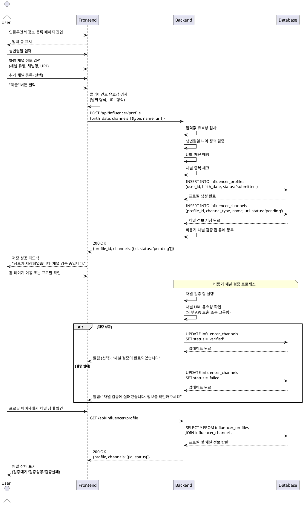

# UC-002: 인플루언서 정보 등록

## Primary Actor

인플루언서 역할로 회원가입을 완료한 사용자

## Precondition

- 사용자가 회원가입 완료 후 인플루언서 역할로 등록됨
- 이메일 인증 완료
- 인플루언서 정보 등록 페이지에 접근

## Trigger

회원가입 완료 후 인플루언서 정보 등록 페이지로 리다이렉트되거나, 사용자가 프로필 설정에서 "인플루언서 정보 등록" 메뉴 선택

## Main Scenario

1. 사용자가 인플루언서 정보 등록 페이지 진입
2. 사용자가 생년월일 입력
3. 사용자가 SNS 채널 정보 입력
   - 채널 유형 선택 (Instagram, YouTube, Blog 등)
   - 채널명 입력
   - 채널 URL 입력
4. 사용자가 추가 채널 등록 (선택사항)
   - "채널 추가" 버튼 클릭
   - 3단계 반복
5. 사용자가 등록된 채널 편집/삭제 (선택사항)
6. 사용자가 "임시저장" 또는 "제출" 버튼 클릭
7. 시스템이 입력값 유효성 검사 수행
   - 생년월일 형식 및 나이 정책 검증
   - URL 형식 및 패턴 매칭
8. 시스템이 `influencer_profiles` 테이블에 프로필 저장
9. 시스템이 `influencer_channels` 테이블에 채널 정보 저장
10. 시스템이 채널 검증 비동기 잡 큐에 등록
11. 시스템이 저장 성공 피드백 표시
12. 채널 검증 상태가 "검증대기"로 설정됨
13. 사용자가 홈 페이지로 이동하거나 내 프로필 확인

## Edge Cases

### 입력 유효성 오류
- **생년월일 형식 오류**: "올바른 날짜 형식을 입력해주세요 (YYYY-MM-DD)" 메시지 표시
- **나이 정책 위반**: 만 14세 미만인 경우 "만 14세 이상만 가입 가능합니다" 메시지 표시
- **URL 형식 오류**: "올바른 URL 형식을 입력해주세요" 메시지 표시
- **채널 유형 미선택**: "채널 유형을 선택해주세요" 메시지 표시
- **필수 항목 누락**: 생년월일 및 최소 1개 채널 정보 필수

### 채널 검증 실패
- 비동기 검증 결과 채널이 존재하지 않거나 접근 불가능한 경우
- 채널 상태가 "검증실패"로 변경
- 사용자에게 알림 또는 프로필 페이지에서 상태 표시
- 사용자가 채널 정보 재수정 가능

### 중복 채널
- 동일한 채널 URL을 여러 번 등록하려는 경우 "이미 등록된 채널입니다" 메시지 표시

### DB 저장 실패
- 네트워크 오류 또는 DB 오류 시 "저장 중 오류가 발생했습니다. 다시 시도해주세요" 메시지 표시
- 임시저장된 데이터는 폼에 복원

### 임시저장
- 사용자가 "임시저장" 선택 시 입력 데이터를 DB에 저장하되, 프로필 상태는 "미완료"로 설정
- 체험단 지원 불가 상태 유지
- 다음 로그인 시 임시저장된 데이터 복원

## Business Rules

### BR-001: 필수 입력 항목
- 생년월일 필수
- 최소 1개 이상의 SNS 채널 정보 필수

### BR-002: 나이 제한
- 만 14세 이상만 인플루언서로 등록 가능

### BR-003: 채널 URL 형식
- 각 채널 유형별 URL 패턴 검증
  - Instagram: `https://www.instagram.com/{username}`
  - YouTube: `https://www.youtube.com/@{channel}` 또는 `/c/{channel}`
  - Blog: 유효한 HTTP(S) URL

### BR-004: 채널 검증
- 등록된 채널은 비동기 검증 프로세스를 거침
- 검증 상태: `pending` (검증대기) → `verified` (검증성공) / `failed` (검증실패)
- 검증 실패 시 사용자는 채널 정보 재수정 가능

### BR-005: 채널 중복 불가
- 동일 사용자가 같은 URL을 중복 등록할 수 없음

### BR-006: 체험단 지원 가능 조건
- 인플루언서 정보 등록 "제출" 완료 필수
- 최소 1개 이상의 채널이 "검증성공" 상태여야 체험단 지원 가능

### BR-007: 임시저장
- 임시저장 시 프로필 상태는 "미완료"
- 임시저장된 정보는 언제든 재수정 및 제출 가능
- 체험단 지원은 제출 완료 후에만 가능

### BR-008: 프로필 수정
- 제출 완료 후에도 채널 추가/편집/삭제 가능
- 수정 시 해당 채널은 다시 검증 프로세스를 거침

---

## Sequence Diagram

