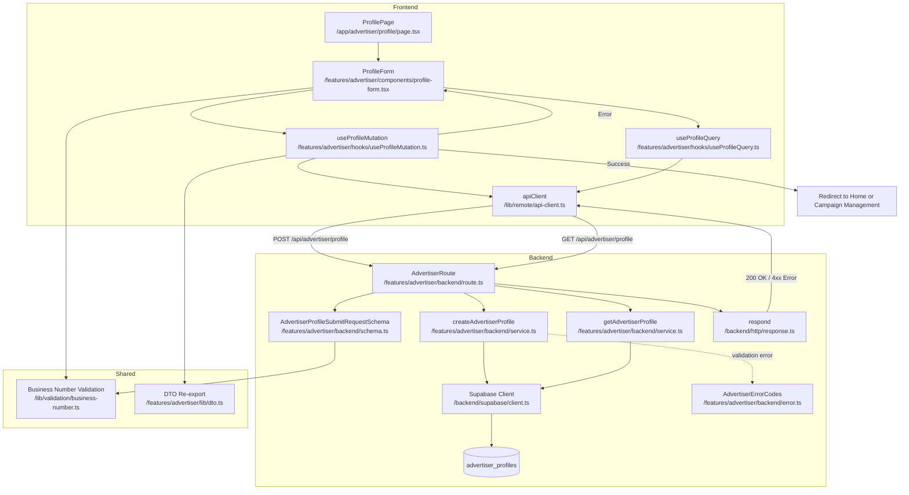

# UC-003: 광고주 정보 등록 - 모듈화 설계

## 개요

### 필요 모듈 목록

#### Backend Layer

1. **src/features/advertiser/backend/schema.ts**
   - 광고주 프로필 등록 요청/응답 Zod 스키마 정의
   - AdvertiserProfileSubmitRequestSchema, AdvertiserProfileSubmitResponseSchema
   - AdvertiserProfileQueryResponseSchema

2. **src/features/advertiser/backend/error.ts**
   - 광고주 정보 등록 관련 에러 코드 정의
   - DUPLICATE_BUSINESS_NUMBER, INVALID_BUSINESS_NUMBER_FORMAT, UNVERIFIED_ADVERTISER 등

3. **src/features/advertiser/backend/validation.ts**
   - 사업자등록번호 형식 검증 함수
   - validateBusinessNumber (000-00-00000 형식)
   - formatBusinessNumber (자동 하이픈 삽입)

4. **src/features/advertiser/backend/service.ts**
   - createAdvertiserProfile: advertiser_profiles 테이블 삽입 또는 업데이트
   - getAdvertiserProfile: 프로필 조회
   - 사업자등록번호 중복 체크
   - 비동기 검증 잡 큐 등록 (향후 구현)

5. **src/features/advertiser/backend/route.ts**
   - POST /api/advertiser/profile 엔드포인트 (제출/임시저장)
   - GET /api/advertiser/profile 엔드포인트 (프로필 조회)

#### Frontend Layer

6. **src/features/advertiser/components/profile-form.tsx**
   - 광고주 정보 등록 폼 UI 컴포넌트
   - react-hook-form + zod 기반 폼 유효성 검사
   - 업체명, 위치, 카테고리, 사업자등록번호 입력

7. **src/features/advertiser/hooks/useProfileMutation.ts**
   - React Query useMutation 훅
   - POST /api/advertiser/profile 호출 (제출/임시저장)
   - 성공 시 홈 페이지 또는 체험단 관리 페이지로 리다이렉트

8. **src/features/advertiser/hooks/useProfileQuery.ts**
   - React Query useQuery 훅
   - GET /api/advertiser/profile 호출 (프로필 및 검증 상태 조회)
   - 임시저장된 데이터 복원

9. **src/features/advertiser/lib/dto.ts**
   - Backend schema 재노출 (클라이언트에서 사용)

10. **src/features/advertiser/lib/validation.ts**
    - 프론트엔드 사업자등록번호 형식 검증 유틸
    - 필드 유효성 검증 유틸

#### Shared Layer

11. **src/lib/validation/business-number.ts** (공통 유틸)
    - 사업자등록번호 형식 검증 함수
    - 자동 포맷팅 함수
    - 다른 feature에서도 재사용 가능

#### Page Layer

12. **src/app/advertiser/profile/page.tsx**
    - 광고주 정보 등록 페이지
    - ProfileForm 컴포넌트 통합
    - 인증된 광고주만 접근 가능

---

## Diagram



---

## Implementation Plan

### 1. Backend Schema (`src/features/advertiser/backend/schema.ts`)

#### 구현 내용
- **AdvertiserProfileSubmitRequestSchema**: 광고주 정보 등록 요청 스키마
  - company_name: string (1~200자)
  - location: string (1~500자)
  - category: string (1~100자)
  - business_number: string (사업자등록번호 형식: 000-00-00000)
  - status: 'draft' | 'submitted' (임시저장/제출)

- **AdvertiserProfileSubmitResponseSchema**: 광고주 정보 등록 응답 스키마
  - profile_id: UUID
  - user_id: UUID
  - company_name: string
  - verification_status: 'pending' | 'verified' | 'failed'

- **AdvertiserProfileQueryResponseSchema**: 프로필 조회 응답 스키마
  - profile: { id, user_id, company_name, location, category, business_number, verification_status }

#### Unit Test Cases
```typescript
describe('AdvertiserProfileSubmitRequestSchema', () => {
  it('유효한 제출 요청을 파싱한다', () => {
    const input = {
      company_name: '맛있는 식당',
      location: '서울시 강남구 테헤란로 123',
      category: '음식점',
      business_number: '123-45-67890',
      status: 'submitted',
    };
    const result = AdvertiserProfileSubmitRequestSchema.safeParse(input);
    expect(result.success).toBe(true);
  });

  it('업체명이 200자 초과면 실패한다', () => {
    const input = { ...validInput, company_name: 'a'.repeat(201) };
    const result = AdvertiserProfileSubmitRequestSchema.safeParse(input);
    expect(result.success).toBe(false);
  });

  it('사업자등록번호 형식이 올바르지 않으면 실패한다', () => {
    const input = { ...validInput, business_number: '1234567890' };
    const result = AdvertiserProfileSubmitRequestSchema.safeParse(input);
    expect(result.success).toBe(false);
  });

  it('임시저장 요청을 파싱한다', () => {
    const input = { ...validInput, status: 'draft' };
    const result = AdvertiserProfileSubmitRequestSchema.safeParse(input);
    expect(result.success).toBe(true);
  });
});
```

---

### 2. Backend Error Codes (`src/features/advertiser/backend/error.ts`)

#### 구현 내용
```typescript
export const advertiserErrorCodes = {
  duplicateBusinessNumber: 'DUPLICATE_BUSINESS_NUMBER',
  invalidBusinessNumberFormat: 'INVALID_BUSINESS_NUMBER_FORMAT',
  profileNotFound: 'PROFILE_NOT_FOUND',
  unverifiedAdvertiser: 'UNVERIFIED_ADVERTISER',
  profileCreationFailed: 'PROFILE_CREATION_FAILED',
  validationError: 'VALIDATION_ERROR',
  unauthorizedAccess: 'UNAUTHORIZED_ACCESS',
} as const;

export type AdvertiserServiceError = (typeof advertiserErrorCodes)[keyof typeof advertiserErrorCodes];
```

---

### 3. Backend Validation (`src/features/advertiser/backend/validation.ts`)

#### 구현 내용
- **validateBusinessNumber**: 사업자등록번호 형식 검증 (000-00-00000)
- **formatBusinessNumber**: 숫자만 입력 시 자동 하이픈 삽입

#### Unit Test Cases
```typescript
describe('validateBusinessNumber', () => {
  it('유효한 사업자등록번호 형식', () => {
    expect(validateBusinessNumber('123-45-67890')).toBe(true);
  });

  it('하이픈 없는 형식은 실패', () => {
    expect(validateBusinessNumber('1234567890')).toBe(false);
  });

  it('자릿수가 맞지 않으면 실패', () => {
    expect(validateBusinessNumber('123-45-6789')).toBe(false);
  });
});

describe('formatBusinessNumber', () => {
  it('10자리 숫자를 000-00-00000 형식으로 변환', () => {
    expect(formatBusinessNumber('1234567890')).toBe('123-45-67890');
  });

  it('이미 포맷된 번호는 그대로 반환', () => {
    expect(formatBusinessNumber('123-45-67890')).toBe('123-45-67890');
  });
});
```

---

### 4. Backend Service (`src/features/advertiser/backend/service.ts`)

#### 구현 내용
- **createAdvertiserProfile** 함수
  - advertiser_profiles 테이블에 INSERT 또는 UPDATE
  - 사업자등록번호 중복 체크
  - user_id 기반 기존 프로필 확인
  - status: 'draft' (임시저장) | 'submitted' (제출)
  - verification_status: 'pending' (검증대기) 기본값
  - 비동기 검증 잡 큐 등록 (향후 구현)

- **getAdvertiserProfile** 함수
  - user_id 기반 프로필 조회
  - verification_status 포함

#### Unit Test Cases
```typescript
describe('createAdvertiserProfile', () => {
  it('유효한 요청으로 광고주 프로필 생성', async () => {
    const supabaseMock = createSupabaseMock();
    const input = {
      user_id: 'user-uuid',
      company_name: '맛있는 식당',
      location: '서울시 강남구',
      category: '음식점',
      business_number: '123-45-67890',
      status: 'submitted',
    };

    const result = await createAdvertiserProfile(supabaseMock, input);

    expect(result.ok).toBe(true);
    expect(result.data.profile_id).toBeDefined();
    expect(result.data.verification_status).toBe('pending');
  });

  it('중복된 사업자등록번호면 DUPLICATE_BUSINESS_NUMBER 반환', async () => {
    const supabaseMock = createSupabaseMockWithDuplicateBusinessNumber();
    const result = await createAdvertiserProfile(supabaseMock, input);

    expect(result.ok).toBe(false);
    expect(result.error.code).toBe(advertiserErrorCodes.duplicateBusinessNumber);
  });

  it('잘못된 사업자등록번호 형식이면 INVALID_BUSINESS_NUMBER_FORMAT 반환', async () => {
    const input = { ...validInput, business_number: '1234567890' };
    const result = await createAdvertiserProfile(createSupabaseMock(), input);

    expect(result.ok).toBe(false);
    expect(result.error.code).toBe(advertiserErrorCodes.invalidBusinessNumberFormat);
  });

  it('임시저장 시 status: draft로 저장', async () => {
    const input = { ...validInput, status: 'draft' };
    const result = await createAdvertiserProfile(createSupabaseMock(), input);

    expect(result.ok).toBe(true);
    expect(result.data.status).toBe('draft');
  });
});

describe('getAdvertiserProfile', () => {
  it('프로필 조회 성공', async () => {
    const supabaseMock = createSupabaseMock();
    const result = await getAdvertiserProfile(supabaseMock, 'user-uuid');

    expect(result.ok).toBe(true);
    expect(result.data.profile).toBeDefined();
  });

  it('프로필이 없으면 PROFILE_NOT_FOUND 반환', async () => {
    const supabaseMock = createSupabaseMockWithNoProfile();
    const result = await getAdvertiserProfile(supabaseMock, 'user-uuid');

    expect(result.ok).toBe(false);
    expect(result.error.code).toBe(advertiserErrorCodes.profileNotFound);
  });
});
```

---

### 5. Backend Route (`src/features/advertiser/backend/route.ts`)

#### 구현 내용
- POST /api/advertiser/profile
  - 요청 바디를 AdvertiserProfileSubmitRequestSchema로 파싱
  - user_id를 인증 컨텍스트에서 추출
  - createAdvertiserProfile 서비스 호출
  - 성공 시 200 OK + AdvertiserProfileSubmitResponse

- GET /api/advertiser/profile
  - user_id를 인증 컨텍스트에서 추출
  - getAdvertiserProfile 서비스 호출
  - 성공 시 200 OK + AdvertiserProfileQueryResponse

#### Unit Test Cases (Integration Test)
```typescript
describe('POST /api/advertiser/profile', () => {
  it('유효한 요청으로 프로필 생성 성공', async () => {
    const response = await request(app).post('/api/advertiser/profile').send({
      company_name: '맛있는 식당',
      location: '서울시 강남구',
      category: '음식점',
      business_number: '123-45-67890',
      status: 'submitted',
    });

    expect(response.status).toBe(200);
    expect(response.body.profile_id).toBeDefined();
  });

  it('중복 사업자등록번호 시 409 에러 반환', async () => {
    await request(app).post('/api/advertiser/profile').send(validPayload);
    const response = await request(app).post('/api/advertiser/profile').send(validPayload);

    expect(response.status).toBe(409);
    expect(response.body.error.code).toBe(advertiserErrorCodes.duplicateBusinessNumber);
  });

  it('사업자등록번호 형식 오류 시 400 에러 반환', async () => {
    const response = await request(app).post('/api/advertiser/profile').send({
      ...validPayload,
      business_number: '1234567890',
    });

    expect(response.status).toBe(400);
    expect(response.body.error.code).toBe(advertiserErrorCodes.invalidBusinessNumberFormat);
  });
});

describe('GET /api/advertiser/profile', () => {
  it('프로필 조회 성공', async () => {
    const response = await request(app).get('/api/advertiser/profile');

    expect(response.status).toBe(200);
    expect(response.body.profile).toBeDefined();
  });

  it('프로필 없으면 404 반환', async () => {
    const response = await request(app).get('/api/advertiser/profile');

    expect(response.status).toBe(404);
    expect(response.body.error.code).toBe(advertiserErrorCodes.profileNotFound);
  });
});
```

---

### 6. Frontend Component (`src/features/advertiser/components/profile-form.tsx`)

#### 구현 내용
- react-hook-form + zod 기반 폼
- 입력 필드:
  - company_name (Text Input, 1~200자)
  - location (Text Input, 1~500자)
  - category (Select: 음식점, 카페, 뷰티, 패션 등)
  - business_number (Text Input, 자동 하이픈 삽입)
- "임시저장" / "제출" 버튼
- useProfileMutation 훅 사용
- useProfileQuery 훅으로 기존 데이터 복원
- 검증 상태 표시 (검증대기/검증성공/검증실패)

#### QA Sheet
| Test Case | Input | Expected Output | Pass/Fail |
|-----------|-------|-----------------|-----------|
| 모든 필드 유효 입력 | company_name: "맛있는 식당", location: "서울시 강남구", category: "음식점", business_number: "123-45-67890", status: "submitted" | 프로필 등록 성공, 홈 페이지 이동 | |
| 업체명 미입력 | company_name: "" | "업체명을 입력해주세요" 에러 표시 | |
| 사업자등록번호 형식 오류 | business_number: "1234567890" | "올바른 사업자등록번호 형식을 입력해주세요 (000-00-00000)" 에러 표시 | |
| 사업자등록번호 자동 포맷팅 | business_number: "1234567890" 입력 | "123-45-67890"으로 자동 변환 | |
| 중복 사업자등록번호 | 이미 등록된 번호 | "이미 등록된 사업자등록번호입니다" 토스트 표시 | |
| 임시저장 | status: "draft" | 임시저장 성공, "임시저장되었습니다" 토스트 표시 | |
| 제출 후 재진입 | 기존 프로필 존재 | 기존 데이터 자동 복원 | |
| 검증 상태 표시 | verification_status: "pending" | "사업자등록번호 검증 중입니다" 안내 표시 | |

---

### 7-10. Frontend Hooks & DTO

#### useProfileMutation
- POST /api/advertiser/profile 호출
- onSuccess: 홈 페이지 또는 체험단 관리 페이지로 리다이렉트

#### useProfileQuery
- GET /api/advertiser/profile 호출
- queryKey: ['advertiser', 'profile']
- 임시저장된 데이터 자동 복원

#### DTO
- Backend schema 재노출

---

### 11. Shared Utility (`src/lib/validation/business-number.ts`)

#### 구현 내용
```typescript
export const validateBusinessNumber = (businessNumber: string): boolean => {
  const regex = /^\d{3}-\d{2}-\d{5}$/;
  return regex.test(businessNumber);
};

export const formatBusinessNumber = (businessNumber: string): string => {
  const digits = businessNumber.replace(/\D/g, '');
  if (digits.length === 10) {
    return `${digits.slice(0, 3)}-${digits.slice(3, 5)}-${digits.slice(5)}`;
  }
  return businessNumber;
};
```

---

### 12. Advertiser Profile Page (`src/app/advertiser/profile/page.tsx`)

#### 구현 내용
- ProfileForm 컴포넌트 통합
- useCurrentUser 훅으로 인증 상태 확인
- 광고주 역할이 아니면 접근 불가 (403)
- 인증되지 않은 사용자는 로그인 페이지로 리다이렉트

#### QA Sheet
| Test Case | Condition | Expected Behavior | Pass/Fail |
|-----------|-----------|-------------------|-----------|
| 비인증 사용자 접근 | isAuthenticated: false | 로그인 페이지로 리다이렉트 | |
| 인플루언서 역할 접근 | role: 'influencer' | 403 에러 표시 | |
| 광고주 역할 접근 | role: 'advertiser' | ProfileForm 렌더링 | |
| 프로필 등록 완료 후 | 제출 완료 | 홈 페이지로 리다이렉트 | |

---

## 구현 순서

1. Shared Utility (business-number.ts) - 공통 유틸 먼저 구현
2. Backend Schema → Error Codes → Validation → Service → Route
3. Frontend DTO (re-export)
4. Frontend Hooks (useProfileQuery → useProfileMutation)
5. Frontend Component (ProfileForm)
6. Page Integration (advertiser/profile/page.tsx)
7. Hono App Configuration (registerAdvertiserRoutes)

---

## 추가 고려사항

### 비동기 사업자등록번호 검증
- 현재 스펙에는 비동기 검증이 명시되어 있으나, 구현은 별도 작업으로 분리
- 프로필 등록 시 verification_status: 'pending'으로 저장
- 향후 비동기 잡 큐 (BullMQ, Supabase Edge Functions)를 통해 국세청 API 호출
- 검증 완료 시 verification_status를 'verified' 또는 'failed'로 업데이트

### 임시저장 기능
- status: 'draft'로 저장하면 제출 전 임시저장 상태
- 체험단 등록 가능 여부: status가 'submitted'이고 verification_status가 'verified'여야 함
- 임시저장 시 폼 복원: useProfileQuery 훅으로 기존 데이터 자동 복원

### 사업자등록번호 중복 방지
- Database 레벨: UNIQUE constraint (business_number)
- Backend 레벨: 등록 전 중복 체크 쿼리
- Frontend 레벨: 중복 에러 시 안내 메시지 표시

### 레이트 리밋
- 5분 내 3회 이상 제출 시도 차단
- Backend 미들웨어 또는 service layer에서 구현

### 프로필 수정
- 제출 완료 후에도 업체명, 위치, 카테고리 수정 가능
- 사업자등록번호는 수정 불가 (UNIQUE constraint)

### Security
- 인증된 사용자만 프로필 등록 가능
- 타인의 프로필 수정 불가 (user_id 검증)

### Accessibility
- 폼 필드에 적절한 label 연결
- 에러 메시지는 role="alert"로 스크린 리더에 알림