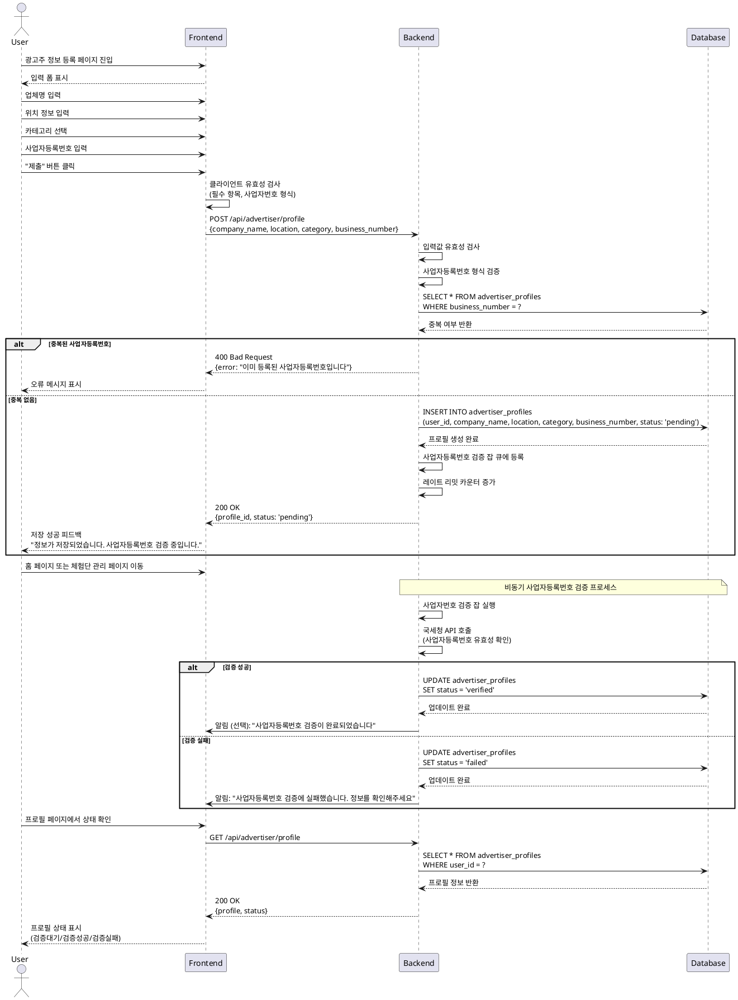

# UC-003: 광고주 정보 등록

## Primary Actor

광고주 역할로 회원가입을 완료한 사용자

## Precondition

- 사용자가 회원가입 완료 후 광고주 역할로 등록됨
- 이메일 인증 완료
- 광고주 정보 등록 페이지에 접근

## Trigger

회원가입 완료 후 광고주 정보 등록 페이지로 리다이렉트되거나, 사용자가 프로필 설정에서 "광고주 정보 등록" 메뉴 선택

## Main Scenario

1. 사용자가 광고주 정보 등록 페이지 진입
2. 사용자가 업체명 입력
3. 사용자가 위치 정보 입력 (주소 또는 지역)
4. 사용자가 카테고리 선택 (음식점, 카페, 뷰티, 패션 등)
5. 사용자가 사업자등록번호 입력
6. 사용자가 "임시저장" 또는 "제출" 버튼 클릭
7. 시스템이 입력값 유효성 검사 수행
   - 필수 항목 누락 확인
   - 사업자등록번호 형식 검증
8. 시스템이 사업자등록번호 중복 여부 확인
9. 시스템이 `advertiser_profiles` 테이블에 프로필 저장
10. 시스템이 사업자등록번호 검증 비동기 잡 큐에 등록
11. 시스템이 저장 성공 피드백 표시
12. 프로필 상태가 "검증대기"로 설정됨
13. 사용자가 홈 페이지 또는 체험단 관리 페이지로 이동

## Edge Cases

### 입력 유효성 오류
- **업체명 누락**: "업체명을 입력해주세요" 메시지 표시
- **위치 정보 누락**: "위치 정보를 입력해주세요" 메시지 표시
- **카테고리 미선택**: "카테고리를 선택해주세요" 메시지 표시
- **사업자등록번호 형식 오류**: "올바른 사업자등록번호 형식을 입력해주세요 (000-00-00000)" 메시지 표시
- **필수 항목 누락**: 모든 필드 필수 입력

### 사업자등록번호 중복
- 이미 등록된 사업자등록번호인 경우 "이미 등록된 사업자등록번호입니다" 메시지 표시
- 중복된 사업자등록번호로는 등록 불가

### 사업자등록번호 검증 실패
- 비동기 검증 결과 사업자등록번호가 유효하지 않거나 국세청 API 오류 발생 시
- 프로필 상태가 "검증실패"로 변경
- 사용자에게 알림 또는 프로필 페이지에서 상태 표시
- 사용자가 정보 재수정 가능

### DB 저장 실패
- 네트워크 오류 또는 DB 오류 시 "저장 중 오류가 발생했습니다. 다시 시도해주세요" 메시지 표시
- 임시저장된 데이터는 폼에 복원

### 임시저장
- 사용자가 "임시저장" 선택 시 입력 데이터를 DB에 저장하되, 프로필 상태는 "미완료"로 설정
- 체험단 등록 불가 상태 유지
- 다음 로그인 시 임시저장된 데이터 복원

### 레이트 리밋
- 동일 사용자가 짧은 시간 내에 여러 번 제출 시도 시 "잠시 후 다시 시도해주세요" 메시지 표시
- 5분 내 3회 이상 제출 차단

## Business Rules

### BR-001: 필수 입력 항목
- 업체명 필수
- 위치 정보 필수
- 카테고리 필수
- 사업자등록번호 필수

### BR-002: 사업자등록번호 형식
- 형식: `000-00-00000` (10자리 숫자, 하이픈 포함)
- 숫자만 입력 시 자동으로 하이픈 삽입

### BR-003: 사업자등록번호 중복 불가
- 동일한 사업자등록번호는 1회만 등록 가능
- 중복 시 등록 차단

### BR-004: 사업자등록번호 검증
- 등록된 사업자등록번호는 비동기 검증 프로세스를 거침
- 검증 상태: `pending` (검증대기) → `verified` (검증성공) / `failed` (검증실패)
- 검증 실패 시 사용자는 정보 재수정 가능

### BR-005: 체험단 등록 가능 조건
- 광고주 정보 등록 "제출" 완료 필수
- 사업자등록번호 "검증성공" 상태여야 체험단 등록 가능

### BR-006: 임시저장
- 임시저장 시 프로필 상태는 "미완료"
- 임시저장된 정보는 언제든 재수정 및 제출 가능
- 체험단 등록은 제출 완료 후에만 가능

### BR-007: 프로필 수정
- 제출 완료 후에도 업체명, 위치, 카테고리 수정 가능
- 사업자등록번호는 수정 불가 (변경 필요 시 관리자 문의)

### BR-008: 레이트 리밋
- 5분 내 3회 이상 제출 시도 차단
- 봇 및 악의적 요청 방지

---

## Sequence Diagram

