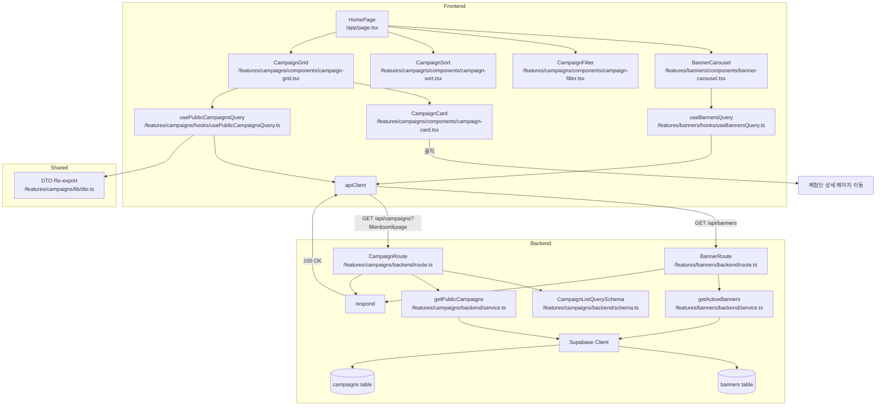

# UC-004: 홈 & 체험단 목록 탐색 - 모듈화 설계

## 개요

### 필요 모듈 목록

#### Backend Layer

1. **src/features/campaigns/backend/schema.ts** (확장)
   - CampaignListQuerySchema (필터링, 정렬, 페이지네이션 파라미터)
   - CampaignPublicListResponseSchema (공개 목록 조회 응답)
   - CampaignCardSchema (카드 정보)

2. **src/features/campaigns/backend/service.ts** (확장)
   - getPublicCampaigns: 모집 중인 체험단 목록 조회
   - 필터링 (카테고리, 지역 등)
   - 정렬 (최신순, 마감임박순 등)
   - 페이지네이션

3. **src/features/campaigns/backend/route.ts** (확장)
   - GET /api/campaigns 엔드포인트 (공개 목록 조회)

4. **src/features/banners/backend/schema.ts** (신규)
   - BannerListResponseSchema

5. **src/features/banners/backend/service.ts** (신규)
   - getActiveBanners: 활성 배너 목록 조회

6. **src/features/banners/backend/route.ts** (신규)
   - GET /api/banners 엔드포인트

#### Frontend Layer

7. **src/features/campaigns/components/campaign-card.tsx**
   - 체험단 카드 컴포넌트
   - 체험단명, 카테고리, 지역, 모집 인원, 마감일 표시

8. **src/features/campaigns/components/campaign-filter.tsx**
   - 필터 UI 컴포넌트
   - 카테고리, 지역 필터

9. **src/features/campaigns/components/campaign-sort.tsx**
   - 정렬 UI 컴포넌트
   - 최신순, 마감임박순, 인기순

10. **src/features/campaigns/components/campaign-grid.tsx**
    - 체험단 그리드 레이아웃
    - CampaignCard 반복 렌더링
    - 페이지네이션

11. **src/features/campaigns/hooks/usePublicCampaignsQuery.ts**
    - React Query useQuery 훅
    - GET /api/campaigns 호출
    - 필터, 정렬, 페이지네이션 지원

12. **src/features/banners/components/banner-carousel.tsx**
    - 배너 캐러셀 컴포넌트
    - 자동 슬라이드

13. **src/features/banners/hooks/useBannersQuery.ts**
    - React Query useQuery 훅
    - GET /api/banners 호출

14. **src/features/campaigns/lib/dto.ts** (확장)
    - Backend schema 재노출

#### Page Layer

15. **src/app/page.tsx** (홈 페이지)
    - BannerCarousel 컴포넌트 통합
    - CampaignGrid 컴포넌트 통합
    - 필터 및 정렬 컴포넌트 통합

---

## Diagram



---

## Implementation Plan

### 1. Backend Schema (`src/features/campaigns/backend/schema.ts` - 확장)

#### 구현 내용
- **CampaignListQuerySchema**: 목록 조회 쿼리 파라미터
  - status?: 'recruiting' (기본값)
  - category?: string (필터)
  - region?: string (필터)
  - sort?: 'latest' | 'deadline' | 'popular' (정렬 기준)
  - page?: number (기본값 1)
  - limit?: number (기본값 20)

- **CampaignCardSchema**: 체험단 카드 정보
  - id: UUID
  - title: string
  - category: string
  - region: string (location에서 추출)
  - max_participants: number
  - applicant_count: number
  - recruitment_end: string
  - thumbnail_url?: string (향후 추가)
  - created_at: string

- **CampaignPublicListResponseSchema**: 공개 목록 조회 응답
  - campaigns: CampaignCardSchema[]
  - total: number
  - page: number
  - limit: number
  - has_more: boolean

#### Unit Test Cases
```typescript
describe('CampaignListQuerySchema', () => {
  it('유효한 쿼리 파라미터를 파싱한다', () => {
    const input = {
      status: 'recruiting',
      category: 'restaurant',
      region: 'seoul',
      sort: 'latest',
      page: 1,
      limit: 20,
    };
    const result = CampaignListQuerySchema.safeParse(input);
    expect(result.success).toBe(true);
  });

  it('파라미터 없이도 성공한다 (기본값 적용)', () => {
    const input = {};
    const result = CampaignListQuerySchema.safeParse(input);
    expect(result.success).toBe(true);
    expect(result.data.status).toBe('recruiting');
    expect(result.data.page).toBe(1);
    expect(result.data.limit).toBe(20);
  });
});
```

---

### 2. Backend Service (`src/features/campaigns/backend/service.ts` - 확장)

#### 구현 내용
- **getPublicCampaigns** 함수
  - 모집 중인 체험단 목록 조회 (status: 'recruiting')
  - 카테고리 필터 적용 (선택적)
  - 지역 필터 적용 (선택적)
  - 정렬 적용:
    - latest: created_at DESC
    - deadline: recruitment_end ASC (마감임박순)
    - popular: applicant_count DESC (인기순)
  - 페이지네이션 적용 (LIMIT, OFFSET)
  - 신청 인원 COUNT 서브쿼리
  - 전체 항목 수 COUNT 조회

#### Unit Test Cases
```typescript
describe('getPublicCampaigns', () => {
  it('모집 중인 체험단 목록 조회 성공', async () => {
    const supabaseMock = createSupabaseMock();
    const result = await getPublicCampaigns(supabaseMock, {});

    expect(result.ok).toBe(true);
    expect(result.data.campaigns).toBeInstanceOf(Array);
    expect(result.data.total).toBeGreaterThanOrEqual(0);
  });

  it('카테고리 필터 적용', async () => {
    const supabaseMock = createSupabaseMock();
    const result = await getPublicCampaigns(supabaseMock, { category: 'restaurant' });

    expect(result.ok).toBe(true);
    expect(result.data.campaigns.every(c => c.category === 'restaurant')).toBe(true);
  });

  it('마감임박순 정렬', async () => {
    const supabaseMock = createSupabaseMock();
    const result = await getPublicCampaigns(supabaseMock, { sort: 'deadline' });

    expect(result.ok).toBe(true);
    // recruitment_end ASC 순서 확인
    const dates = result.data.campaigns.map(c => new Date(c.recruitment_end));
    expect(dates).toEqual([...dates].sort((a, b) => a - b));
  });

  it('페이지네이션 적용', async () => {
    const supabaseMock = createSupabaseMock();
    const result = await getPublicCampaigns(supabaseMock, { page: 2, limit: 10 });

    expect(result.ok).toBe(true);
    expect(result.data.page).toBe(2);
    expect(result.data.campaigns.length).toBeLessThanOrEqual(10);
  });
});
```

---

### 3. Backend Route (`src/features/campaigns/backend/route.ts` - 확장)

#### 구현 내용
- GET /api/campaigns
  - 쿼리 파라미터를 CampaignListQuerySchema로 파싱
  - getPublicCampaigns 서비스 호출
  - 성공 시 200 OK + CampaignPublicListResponse
  - 인증 불필요 (공개 API)

#### Unit Test Cases (Integration Test)
```typescript
describe('GET /api/campaigns', () => {
  it('모집 중인 체험단 목록 조회 성공', async () => {
    const response = await request(app).get('/api/campaigns');

    expect(response.status).toBe(200);
    expect(response.body.campaigns).toBeInstanceOf(Array);
  });

  it('카테고리 필터 적용', async () => {
    const response = await request(app).get('/api/campaigns?category=restaurant');

    expect(response.status).toBe(200);
    expect(response.body.campaigns.every(c => c.category === 'restaurant')).toBe(true);
  });

  it('정렬 적용', async () => {
    const response = await request(app).get('/api/campaigns?sort=deadline');

    expect(response.status).toBe(200);
    // 마감임박순 확인
  });
});
```

---

### 4-6. Banner Feature (신규)

#### Backend Schema (`src/features/banners/backend/schema.ts`)
```typescript
export const BannerItemSchema = z.object({
  id: z.string().uuid(),
  title: z.string(),
  image_url: z.string().url(),
  link_url: z.string().url().optional(),
  position: z.number(),
});

export const BannerListResponseSchema = z.object({
  banners: z.array(BannerItemSchema),
});
```

#### Backend Service (`src/features/banners/backend/service.ts`)
- **getActiveBanners**: 활성 배너 목록 조회 (active: true, ORDER BY position)

#### Backend Route (`src/features/banners/backend/route.ts`)
- GET /api/banners

---

### 7. Frontend Component (`src/features/campaigns/components/campaign-card.tsx`)

#### 구현 내용
- 체험단 카드
- 표시 정보:
  - 썸네일 이미지 (placeholder)
  - 체험단명
  - 카테고리 배지
  - 지역 정보
  - 모집 인원 / 신청 인원
  - 마감일 (D-day 형식)
- 클릭 시 체험단 상세 페이지로 이동
- 호버 효과

#### QA Sheet
| Test Case | Condition | Expected Behavior | Pass/Fail |
|-----------|-----------|-------------------|-----------|
| 카드 렌더링 | 유효한 데이터 | 체험단 정보 표시 | |
| 마감임박 표시 | D-3 이하 | 빨간색 "마감임박" 배지 표시 | |
| 카드 클릭 | - | 체험단 상세 페이지로 이동 | |
| 호버 효과 | 마우스 오버 | 카드 shadow 효과 | |

---

### 8-10. Filter & Sort Components

#### CampaignFilter
- 카테고리 필터 (음식점, 카페, 뷰티, 패션 등)
- 지역 필터 (서울, 경기, 부산 등)
- 다중 선택 가능
- URL 쿼리 스트링 동기화

#### CampaignSort
- 정렬 옵션 (최신순, 마감임박순, 인기순)
- Dropdown 또는 Tabs 형태
- URL 쿼리 스트링 동기화

#### CampaignGrid
- CampaignCard 그리드 레이아웃 (3-4 columns)
- 페이지네이션 또는 무한 스크롤
- 로딩 상태, 빈 상태 처리

---

### 11. Frontend Hook (`src/features/campaigns/hooks/usePublicCampaignsQuery.ts`)

#### 구현 내용
- useQuery 사용
- queryKey: ['campaigns', 'public', { category, region, sort, page }]
- queryFn: GET /api/campaigns via apiClient
- enabled: true (인증 불필요)
- 쿼리 파라미터 변경 시 자동 리페치

#### Unit Test Cases
```typescript
describe('usePublicCampaignsQuery', () => {
  it('체험단 목록 조회 성공', async () => {
    const { result } = renderHook(() => usePublicCampaignsQuery({}), { wrapper: QueryWrapper });

    await waitFor(() => expect(result.current.isSuccess).toBe(true));
    expect(result.current.data.campaigns).toBeInstanceOf(Array);
  });

  it('카테고리 필터 적용', async () => {
    const { result } = renderHook(() => usePublicCampaignsQuery({ category: 'restaurant' }), { wrapper: QueryWrapper });

    await waitFor(() => expect(result.current.isSuccess).toBe(true));
    expect(result.current.data.campaigns.every(c => c.category === 'restaurant')).toBe(true);
  });
});
```

---

### 12-13. Banner Components & Hook

#### BannerCarousel
- 배너 이미지 슬라이드
- 자동 재생 (5초 간격)
- 좌우 화살표 네비게이션
- 인디케이터 (점) 표시

#### useBannersQuery
- GET /api/banners 호출
- queryKey: ['banners']
- staleTime: 10분 (배너는 자주 변경되지 않음)

---

### 15. Home Page (`src/app/page.tsx`)

#### 구현 내용
- BannerCarousel 통합 (상단)
- 필터 및 정렬 UI (중단)
- CampaignGrid 통합 (하단)
- 로그인 여부 무관하게 접근 가능

#### QA Sheet
| Test Case | Condition | Expected Behavior | Pass/Fail |
|-----------|-----------|-------------------|-----------|
| 홈 페이지 접속 | - | 배너 + 체험단 목록 표시 | |
| 비로그인 사용자 | isAuthenticated: false | 목록 조회 가능, 지원 버튼 비활성화 | |
| 필터 적용 | 카테고리: 음식점 | 음식점 체험단만 표시 | |
| 정렬 변경 | 마감임박순 선택 | 마감일 가까운 순서로 정렬 | |
| 체험단 없음 | campaigns.length === 0 | "현재 모집 중인 체험단이 없습니다" 안내 | |
| 페이지 이동 | 페이지 2 클릭 | 다음 페이지 목록 로드 | |

---

## 구현 순서

1. Backend Schema 확장 (CampaignListQuerySchema, CampaignCardSchema)
2. Banner Feature 구현 (Backend: schema → service → route)
3. Backend Service 확장 (getPublicCampaigns)
4. Backend Route 확장 (GET /api/campaigns)
5. Frontend DTO 확장
6. Frontend Hooks (useBannersQuery, usePublicCampaignsQuery)
7. Frontend Components (CampaignCard → CampaignFilter → CampaignSort → CampaignGrid)
8. Banner Components (BannerCarousel)
9. Page Integration (app/page.tsx)

---

## 추가 고려사항

### 캐싱 전략
- React Query 캐싱으로 빠른 재방문 경험
- staleTime: 5분 (체험단 목록은 자주 변경됨)
- 배너는 10분 캐싱

### 페이지네이션 vs 무한 스크롤
- 초기 구현: 페이지네이션 (20개씩)
- 향후 확장: 무한 스크롤 옵션 제공

### 필터 조합
- 카테고리 + 지역 필터 동시 적용 가능 (AND 조건)
- URL 쿼리 스트링으로 상태 관리

### 정렬 우선순위
- 기본: 최신순 (created_at DESC)
- 마감임박순: recruitment_end ASC
- 인기순: applicant_count DESC

### 빈 상태 처리
- 체험단 없음: 안내 메시지 + 일러스트레이션
- 필터 결과 없음: "조건에 맞는 체험단이 없습니다" + 필터 초기화 버튼

### 성능 최적화
- 이미지 lazy loading
- 서버 사이드 렌더링 (Next.js SSR)
- DB 쿼리 최적화 (인덱스 활용)

### 접근 권한
- 공개 API (인증 불필요)
- 로그인하지 않은 사용자도 목록 조회 가능
- 지원 버튼은 로그인 시에만 활성화

### SEO 최적화
- 메타 태그 설정
- Open Graph 태그
- 체험단 목록 SSR로 크롤링 가능하게