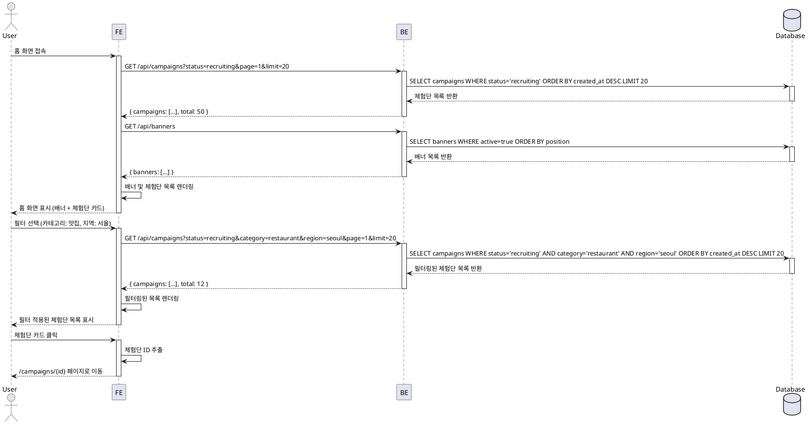

# UC-004: 홈 & 체험단 목록 탐색

## Primary Actor

인플루언서 (로그인 여부 무관)

## Precondition

- 사용자가 애플리케이션 홈 화면에 접근 가능
- 하나 이상의 체험단이 DB에 등록되어 있음 (선택사항)

## Trigger

- 사용자가 애플리케이션 홈 화면에 접속
- 사용자가 필터나 정렬 옵션을 변경
- 사용자가 체험단 카드를 클릭

## Main Scenario

1. 사용자가 홈 화면에 접속한다
2. 시스템은 모집 중인 체험단 목록을 DB에서 조회한다
3. 시스템은 배너 정보를 로드한다
4. 시스템은 기본 정렬(최신순)로 체험단 목록을 렌더링한다
5. 사용자는 필터(카테고리, 지역 등) 또는 정렬(최신순, 마감임박순, 인기순)을 선택한다
6. 시스템은 선택된 조건에 따라 목록을 필터링/정렬하여 다시 렌더링한다
7. 사용자는 원하는 체험단 카드를 클릭한다
8. 시스템은 해당 체험단의 상세 페이지로 이동한다

## Alternative Scenarios

### A1. 모집 중인 체험단이 없는 경우

- 3a. 시스템은 "현재 모집 중인 체험단이 없습니다" 메시지를 표시한다
- 3b. 사용자는 다른 메뉴로 이동하거나 대기한다

### A2. 페이지네이션

- 6a. 체험단 목록이 많을 경우 시스템은 페이지네이션을 적용한다
- 6b. 사용자는 "더보기" 버튼 또는 페이지 번호를 클릭하여 추가 항목을 로드한다
- 6c. 시스템은 다음 페이지의 체험단 목록을 조회하여 추가한다

### A3. 로딩 실패

- 2a. DB 조회 중 오류 발생 시 시스템은 에러 메시지를 표시한다
- 2b. 사용자는 "새로고침" 버튼을 통해 재시도할 수 있다

## Edge Cases

- **네트워크 오류**: 목록 로드 중 연결 실패 시 재시도 안내 표시
- **DB 타임아웃**: 조회 시간 초과 시 에러 처리 및 기본 빈 목록 반환
- **잘못된 필터 조합**: 유효하지 않은 필터 선택 시 기본 조건으로 리셋
- **동시 접속**: 다수의 사용자가 동시에 접속해도 성능 저하 없이 목록 제공
- **캐싱**: 짧은 시간 내 반복 요청 시 캐시된 데이터로 응답 최적화

## Business Rules

- BR-001: 모집 기간이 종료된 체험단은 목록에 표시되지 않는다
- BR-002: 체험단은 기본적으로 최신 등록순으로 정렬된다
- BR-003: 필터는 다중 선택이 가능하며, AND 조건으로 적용된다
- BR-004: 페이지네이션은 한 번에 20개의 항목을 로드한다
- BR-005: 배너는 관리자가 등록한 순서대로 표시되며, 최대 5개까지 노출된다
- BR-006: 로그인하지 않은 사용자도 목록 조회는 가능하나, 체험단 지원은 불가능하다

## Sequence Diagram

