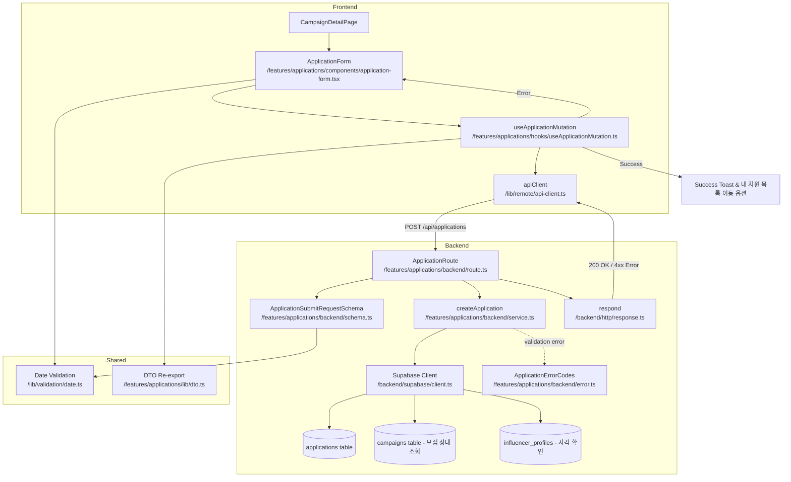

# UC-006: 체험단 지원 - 모듈화 설계

## 개요

### 필요 모듈 목록

#### Backend Layer

1. **src/features/applications/backend/schema.ts**
   - 체험단 지원 요청/응답 Zod 스키마 정의
   - ApplicationSubmitRequestSchema, ApplicationSubmitResponseSchema
   - 클라이언트 측에서 재사용 가능

2. **src/features/applications/backend/error.ts**
   - 체험단 지원 관련 에러 코드 정의
   - DUPLICATE_APPLICATION, CAMPAIGN_CLOSED, UNVERIFIED_INFLUENCER 등

3. **src/features/applications/backend/service.ts**
   - 체험단 지원 비즈니스 로직
   - createApplication: applications 테이블에 INSERT
   - 중복 지원 체크, 모집 기간 검증, 인플루언서 자격 검증

4. **src/features/applications/backend/route.ts**
   - POST /api/applications 엔드포인트
   - 요청 파싱, 서비스 호출, 응답 반환

#### Frontend Layer

5. **src/features/applications/components/application-form.tsx**
   - 지원 폼 UI 컴포넌트 (Dialog 형태)
   - react-hook-form + zod 기반 폼 유효성 검사
   - 각오 한마디, 방문 예정일자 입력

6. **src/features/applications/hooks/useApplicationMutation.ts**
   - React Query useMutation 훅
   - POST /api/applications 호출
   - 성공 시 내 지원 목록으로 이동 옵션 제공

7. **src/features/applications/lib/dto.ts**
   - Backend schema 재노출 (클라이언트에서 사용)

8. **src/features/applications/lib/validation.ts**
   - 각오 한마디 길이 검증 (1~500자)
   - 방문 예정일자 범위 검증

#### Shared Layer

9. **src/lib/validation/date.ts** (기존 재사용)
   - 날짜 형식 검증 함수
   - 날짜 범위 검증 함수

#### Integration

10. **src/features/campaigns/components/campaign-detail.tsx** (수정)
    - ApplicationForm 컴포넌트 통합
    - 지원 버튼 클릭 시 Dialog 표시

---

## Diagram



---

## Implementation Plan

### 1. Backend Schema (`src/features/applications/backend/schema.ts`)

#### 구현 내용
- **ApplicationSubmitRequestSchema**: 지원 요청 스키마
  - campaign_id: UUID
  - message: string (1~500자)
  - planned_visit_date: string (YYYY-MM-DD, 현재 날짜 이후)

- **ApplicationSubmitResponseSchema**: 지원 응답 스키마
  - application_id: UUID
  - campaign_id: UUID
  - user_id: UUID
  - status: 'pending' (신청완료)
  - created_at: string (ISO datetime)

#### Unit Test Cases
```typescript
describe('ApplicationSubmitRequestSchema', () => {
  it('유효한 지원 요청을 파싱한다', () => {
    const input = {
      campaign_id: 'uuid-1234',
      message: '정성껏 리뷰하겠습니다!',
      planned_visit_date: '2025-01-15',
    };
    const result = ApplicationSubmitRequestSchema.safeParse(input);
    expect(result.success).toBe(true);
  });

  it('각오 한마디가 1자 미만이면 실패한다', () => {
    const input = { ...validInput, message: '' };
    const result = ApplicationSubmitRequestSchema.safeParse(input);
    expect(result.success).toBe(false);
  });

  it('각오 한마디가 500자 초과면 실패한다', () => {
    const input = { ...validInput, message: 'a'.repeat(501) };
    const result = ApplicationSubmitRequestSchema.safeParse(input);
    expect(result.success).toBe(false);
  });

  it('과거 날짜면 실패한다', () => {
    const input = { ...validInput, planned_visit_date: '2020-01-01' };
    const result = ApplicationSubmitRequestSchema.safeParse(input);
    expect(result.success).toBe(false);
  });
});
```

---

### 2. Backend Error Codes (`src/features/applications/backend/error.ts`)

#### 구현 내용
```typescript
export const applicationErrorCodes = {
  duplicateApplication: 'DUPLICATE_APPLICATION',
  campaignClosed: 'CAMPAIGN_CLOSED',
  campaignNotFound: 'CAMPAIGN_NOT_FOUND',
  unverifiedInfluencer: 'UNVERIFIED_INFLUENCER',
  invalidVisitDate: 'INVALID_VISIT_DATE',
  applicationCreationFailed: 'APPLICATION_CREATION_FAILED',
  validationError: 'VALIDATION_ERROR',
  unauthorizedAccess: 'UNAUTHORIZED_ACCESS',
} as const;

export type ApplicationServiceError = (typeof applicationErrorCodes)[keyof typeof applicationErrorCodes];
```

---

### 3. Backend Service (`src/features/applications/backend/service.ts`)

#### 구현 내용
- **createApplication** 함수
  - 입력값 검증 (campaign_id, message, planned_visit_date)
  - 모집 기간 내 여부 확인 (campaigns.recruitment_start ~ recruitment_end)
  - 중복 지원 방지 (UNIQUE constraint: campaign_id + user_id)
  - 인플루언서 자격 확인 (influencer_profiles 존재 여부 + 채널 검증 완료)
  - applications 테이블에 INSERT (status: 'pending')
  - 감사 로그 기록 (선택적)

#### Unit Test Cases
```typescript
describe('createApplication', () => {
  it('유효한 요청으로 지원 생성 성공', async () => {
    const supabaseMock = createSupabaseMock();
    const input = {
      user_id: 'user-uuid',
      campaign_id: 'campaign-uuid',
      message: '정성껏 리뷰하겠습니다!',
      planned_visit_date: '2025-01-15',
    };

    const result = await createApplication(supabaseMock, input);

    expect(result.ok).toBe(true);
    expect(result.data.application_id).toBeDefined();
    expect(result.data.status).toBe('pending');
  });

  it('중복 지원 시 DUPLICATE_APPLICATION 반환', async () => {
    const supabaseMock = createSupabaseMockWithDuplicateApplication();
    const result = await createApplication(supabaseMock, input);

    expect(result.ok).toBe(false);
    expect(result.error.code).toBe(applicationErrorCodes.duplicateApplication);
  });

  it('모집 기간 종료 시 CAMPAIGN_CLOSED 반환', async () => {
    const supabaseMock = createSupabaseMockWithClosedCampaign();
    const result = await createApplication(supabaseMock, input);

    expect(result.ok).toBe(false);
    expect(result.error.code).toBe(applicationErrorCodes.campaignClosed);
  });

  it('미검증 인플루언서 시 UNVERIFIED_INFLUENCER 반환', async () => {
    const supabaseMock = createSupabaseMockWithUnverifiedInfluencer();
    const result = await createApplication(supabaseMock, input);

    expect(result.ok).toBe(false);
    expect(result.error.code).toBe(applicationErrorCodes.unverifiedInfluencer);
  });

  it('체험단이 존재하지 않으면 CAMPAIGN_NOT_FOUND 반환', async () => {
    const supabaseMock = createSupabaseMockWithNoCampaign();
    const result = await createApplication(supabaseMock, input);

    expect(result.ok).toBe(false);
    expect(result.error.code).toBe(applicationErrorCodes.campaignNotFound);
  });
});
```

---

### 4. Backend Route (`src/features/applications/backend/route.ts`)

#### 구현 내용
- POST /api/applications
  - 요청 바디를 ApplicationSubmitRequestSchema로 파싱
  - user_id를 인증 컨텍스트에서 추출
  - createApplication 서비스 호출
  - 성공 시 200 OK + ApplicationSubmitResponse
  - 실패 시 4xx/5xx + ErrorResult

#### Unit Test Cases (Integration Test)
```typescript
describe('POST /api/applications', () => {
  it('유효한 요청으로 지원 성공', async () => {
    const response = await request(app).post('/api/applications').send({
      campaign_id: 'campaign-uuid',
      message: '정성껏 리뷰하겠습니다!',
      planned_visit_date: '2025-01-15',
    });

    expect(response.status).toBe(200);
    expect(response.body.application_id).toBeDefined();
    expect(response.body.status).toBe('pending');
  });

  it('중복 지원 시 409 에러 반환', async () => {
    await request(app).post('/api/applications').send(validPayload);
    const response = await request(app).post('/api/applications').send(validPayload);

    expect(response.status).toBe(409);
    expect(response.body.error.code).toBe(applicationErrorCodes.duplicateApplication);
  });

  it('모집 종료 시 400 에러 반환', async () => {
    const response = await request(app).post('/api/applications').send({
      ...validPayload,
      campaign_id: 'closed-campaign-uuid',
    });

    expect(response.status).toBe(400);
    expect(response.body.error.code).toBe(applicationErrorCodes.campaignClosed);
  });

  it('인증되지 않은 사용자 시 401 에러 반환', async () => {
    const response = await request(app).post('/api/applications').send(validPayload);

    expect(response.status).toBe(401);
    expect(response.body.error.code).toBe(applicationErrorCodes.unauthorizedAccess);
  });
});
```

---

### 5. Frontend Component (`src/features/applications/components/application-form.tsx`)

#### 구현 내용
- Dialog 형태의 지원 폼
- react-hook-form + zod 기반 폼
- 입력 필드:
  - message (Textarea, 1~500자, 실시간 글자 수 표시)
  - planned_visit_date (Date Picker, 현재 날짜 이후만 선택 가능)
- 클라이언트 측 실시간 유효성 검사
- useApplicationMutation 훅 사용
- 제출 중 버튼 disabled 처리
- 에러 메시지 표시 (toast 또는 inline)

#### QA Sheet
| Test Case | Input | Expected Output | Pass/Fail |
|-----------|-------|-----------------|-----------|
| 모든 필드 유효 입력 | message: "정성껏 리뷰하겠습니다!", planned_visit_date: "2025-01-15" | 지원 성공, "지원이 완료되었습니다" 토스트 표시 | |
| 각오 한마디 미입력 | message: "" | "각오 한마디를 입력해주세요" 에러 표시 | |
| 각오 한마디 500자 초과 | message: "a".repeat(501) | "500자 이하로 입력해주세요" 에러 표시 | |
| 과거 날짜 선택 | planned_visit_date: "2020-01-01" | "현재 날짜 이후를 선택해주세요" 에러 표시 | |
| 중복 지원 | 이미 지원한 체험단 | "이미 지원하신 체험단입니다" 토스트 표시 | |
| 모집 종료된 체험단 | status: "closed" | "모집이 종료된 체험단입니다" 토스트 표시 | |
| 제출 성공 후 | 지원 완료 | Dialog 닫기, 내 지원 목록으로 이동 옵션 제공 | |
| 글자 수 실시간 표시 | message 입력 중 | "0/500" → "10/500" 실시간 업데이트 | |

---

### 6. Frontend Hook (`src/features/applications/hooks/useApplicationMutation.ts`)

#### 구현 내용
- useMutation 사용
- mutationFn: POST /api/applications via apiClient
- onSuccess: 성공 토스트 표시, Dialog 닫기, 내 지원 목록으로 이동 옵션 제공
- onError: 에러 메시지 추출 및 toast 표시
- 중복 지원 에러 시 특별 처리 (이미 지원한 체험단입니다)

#### Unit Test Cases (React Testing Library + MSW)
```typescript
describe('useApplicationMutation', () => {
  it('지원 성공 시 onSuccess 콜백 호출', async () => {
    const { result } = renderHook(() => useApplicationMutation(), { wrapper: QueryWrapper });

    act(() => {
      result.current.mutate({
        campaign_id: 'campaign-uuid',
        message: '정성껏 리뷰하겠습니다!',
        planned_visit_date: '2025-01-15',
      });
    });

    await waitFor(() => expect(result.current.isSuccess).toBe(true));
    expect(result.current.data.status).toBe('pending');
  });

  it('중복 지원 에러 시 onError 콜백 호출', async () => {
    server.use(
      rest.post('/api/applications', (req, res, ctx) => {
        return res(ctx.status(409), ctx.json({ error: { code: 'DUPLICATE_APPLICATION', message: '이미 지원하신 체험단입니다' } }));
      })
    );

    const { result } = renderHook(() => useApplicationMutation(), { wrapper: QueryWrapper });

    act(() => {
      result.current.mutate(validInput);
    });

    await waitFor(() => expect(result.current.isError).toBe(true));
    expect(result.current.error.code).toBe('DUPLICATE_APPLICATION');
  });
});
```

---

### 7. Frontend DTO (`src/features/applications/lib/dto.ts`)

#### 구현 내용
```typescript
export {
  ApplicationSubmitRequestSchema,
  ApplicationSubmitResponseSchema,
  type ApplicationSubmitRequest,
  type ApplicationSubmitResponse,
} from '@/features/applications/backend/schema';
```

---

### 8. Frontend Validation Utility (`src/features/applications/lib/validation.ts`)

#### 구현 내용
```typescript
export const isValidMessage = (message: string): boolean => {
  return message.length >= 1 && message.length <= 500;
};

export const isValidVisitDate = (visitDate: string, recruitmentEnd: string): boolean => {
  const today = new Date();
  today.setHours(0, 0, 0, 0);
  const visit = new Date(visitDate);
  const end = new Date(recruitmentEnd);

  return visit >= today && visit <= end;
};
```

#### Unit Test Cases
```typescript
describe('isValidMessage', () => {
  it('1~500자 범위 내 메시지는 true 반환', () => {
    expect(isValidMessage('정성껏 리뷰하겠습니다!')).toBe(true);
  });

  it('빈 문자열은 false 반환', () => {
    expect(isValidMessage('')).toBe(false);
  });

  it('500자 초과는 false 반환', () => {
    expect(isValidMessage('a'.repeat(501))).toBe(false);
  });
});

describe('isValidVisitDate', () => {
  it('현재 날짜 이후이고 모집 종료일 이전이면 true', () => {
    const visitDate = '2025-01-15';
    const recruitmentEnd = '2025-01-31';
    expect(isValidVisitDate(visitDate, recruitmentEnd)).toBe(true);
  });

  it('과거 날짜면 false', () => {
    const visitDate = '2020-01-01';
    const recruitmentEnd = '2025-01-31';
    expect(isValidVisitDate(visitDate, recruitmentEnd)).toBe(false);
  });
});
```

---

### 9. Campaign Detail Integration (기존 컴포넌트 수정)

#### 구현 내용
- 기존 CampaignDetail 컴포넌트에 ApplicationForm 통합
- "지원하기" 버튼 클릭 시 Dialog 표시
- 지원 가능 여부에 따라 버튼 활성화/비활성화
- 이미 지원한 체험단은 "지원 완료" 상태 표시

#### QA Sheet
| Test Case | Condition | Expected Behavior | Pass/Fail |
|-----------|-----------|-------------------|-----------|
| 지원 가능한 체험단 | 모집 중, 미지원, 인플루언서 검증 완료 | "지원하기" 버튼 활성화 | |
| 이미 지원한 체험단 | applications 존재 | "지원 완료" 배지 표시, 버튼 비활성화 | |
| 모집 종료된 체험단 | status: "closed" | "모집 종료" 배지 표시, 버튼 비활성화 | |
| 미검증 인플루언서 | 채널 검증 미완료 | "채널 검증 후 지원 가능합니다" 안내, 버튼 비활성화 | |
| 지원하기 버튼 클릭 | 활성화 상태 | ApplicationForm Dialog 표시 | |
| 지원 완료 후 | 성공 | Dialog 닫기, "지원 완료" 상태로 변경 | |

---

## 구현 순서

1. Backend Schema → Error Codes → Service → Route (순서대로 의존성 고려)
2. Shared Validation Utility (date.ts 재사용)
3. Frontend DTO (re-export)
4. Frontend Validation Utility
5. Frontend Hook (useApplicationMutation)
6. Frontend Component (ApplicationForm)
7. Campaign Detail Integration (기존 컴포넌트 수정)
8. Hono App Configuration (registerApplicationRoutes)

---

## 추가 고려사항

### 중복 지원 방지
- Database 레벨: UNIQUE constraint (campaign_id, user_id)
- Backend 레벨: 지원 전 중복 체크 쿼리
- Frontend 레벨: 이미 지원한 체험단은 버튼 비활성화

### 모집 기간 검증
- Backend에서 campaigns.recruitment_start ~ recruitment_end 확인
- 현재 시각이 범위 내에 있는지 검증

### 인플루언서 자격 검증
- influencer_profiles 존재 여부 확인
- influencer_channels에서 최소 1개 이상의 verified 채널 존재 확인

### 감사 로그
- 지원 생성 시 audit_logs 테이블에 기록 (선택적)
- user_id, action: 'application_created', metadata: { campaign_id, application_id }

### 알림 (향후 구현)
- 지원 완료 시 광고주에게 알림 발송
- 선정/반려 시 인플루언서에게 알림 발송