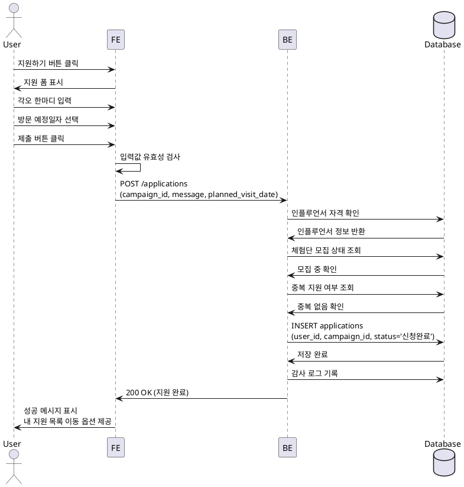

# Feature 6: 체험단 지원

## Primary Actor
인플루언서 (Influencer)

## Precondition
- 인플루언서로 회원가입 완료
- 인플루언서 정보 등록 완료 (SNS 채널 검증 완료)
- 체험단 상세 페이지에서 지원 버튼 클릭
- 모집 중인 체험단

## Trigger
사용자가 체험단 상세 페이지에서 "지원하기" 버튼을 클릭

## Main Scenario
1. 사용자가 체험단 상세 페이지에서 "지원하기" 버튼 클릭
2. 지원 폼이 표시됨 (각오 한마디, 방문 예정일자 입력 필드)
3. 사용자가 각오 한마디 입력 (텍스트)
4. 사용자가 방문 예정일자 선택 (날짜 선택기)
5. 사용자가 "제출" 버튼 클릭
6. FE에서 입력값 유효성 검사 수행
7. BE로 지원 데이터 전송 (campaign_id, user_id, message, planned_visit_date)
8. BE에서 다음 검증 수행:
   - 모집 기간 내 여부 확인
   - 중복 지원 방지 (이미 지원한 체험단인지 확인)
   - 인플루언서 자격 확인
9. `applications` 테이블에 지원 정보 저장 (상태: 신청완료)
10. 감사 로그 기록
11. 성공 응답 반환
12. FE에서 성공 메시지 표시 및 내 지원 목록으로 이동 옵션 제공

## Edge Cases
- **중복 지원**: 이미 지원한 체험단인 경우 "이미 지원하신 체험단입니다" 오류 메시지
- **모집 기간 종료**: 모집 기간이 종료된 경우 "모집이 종료된 체험단입니다" 오류
- **미검증 인플루언서**: SNS 채널 검증이 완료되지 않은 경우 "채널 검증 후 지원 가능합니다" 안내
- **필수 입력값 누락**: 각오 한마디 또는 방문 예정일자 미입력 시 "필수 입력 항목입니다" 경고
- **잘못된 날짜**: 과거 날짜 또는 모집 기간 외 날짜 선택 시 유효성 검사 실패
- **네트워크 오류**: 제출 중 오류 발생 시 재시도 안내

## Business Rules
- 한 체험단에 한 번만 지원 가능 (중복 지원 불가)
- 모집 기간 내에만 지원 가능
- 인플루언서 채널 검증 완료 상태여야 지원 가능
- 각오 한마디는 1~500자 제한
- 방문 예정일자는 현재 날짜 이후, 체험단 종료일 이전이어야 함
- 지원 후 상태는 "신청완료"로 초기화되며, 광고주의 선정 프로세스를 거쳐 "선정" 또는 "반려"로 변경됨

## Sequence Diagram

