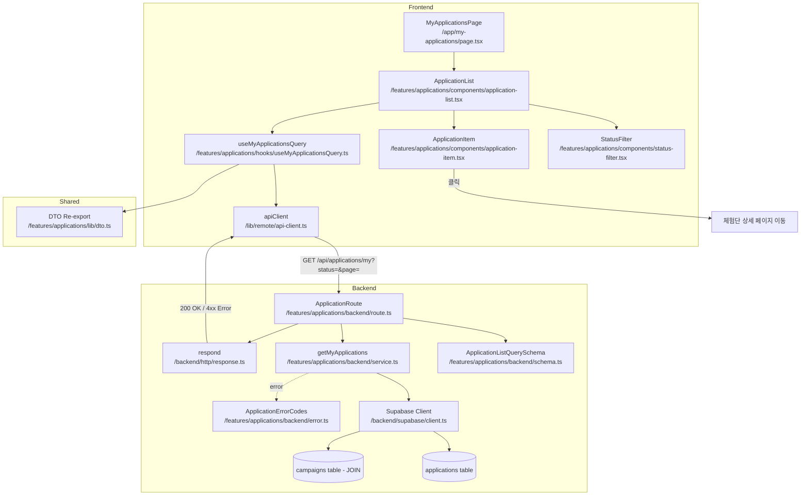

# UC-007: 내 지원 목록 (인플루언서 전용) - 모듈화 설계

## 개요

### 필요 모듈 목록

#### Backend Layer

1. **src/features/applications/backend/schema.ts** (확장)
   - ApplicationListQuerySchema (필터링 파라미터)
   - ApplicationListResponseSchema (목록 조회 응답)
   - ApplicationItemSchema (목록 항목 정보)

2. **src/features/applications/backend/service.ts** (확장)
   - getMyApplications: 본인 지원 목록 조회 (필터, 페이지네이션)
   - JOIN applications + campaigns 테이블

3. **src/features/applications/backend/route.ts** (확장)
   - GET /api/applications/my 엔드포인트
   - 쿼리 파라미터: status, page, limit

#### Frontend Layer

4. **src/features/applications/components/application-list.tsx**
   - 지원 목록 UI 컴포넌트
   - 상태 필터 (전체 / 신청완료 / 선정 / 반려)
   - 지원 항목 카드 렌더링
   - 페이지네이션

5. **src/features/applications/components/application-item.tsx**
   - 지원 항목 카드 컴포넌트
   - 체험단명, 지원 일시, 상태, 각오 한마디(요약), 방문 예정일자 표시

6. **src/features/applications/components/status-filter.tsx**
   - 상태 필터 UI 컴포넌트
   - Tabs 또는 Select 형태

7. **src/features/applications/hooks/useMyApplicationsQuery.ts**
   - React Query useQuery 훅
   - GET /api/applications/my 호출
   - 필터 및 페이지네이션 지원

8. **src/features/applications/lib/dto.ts** (확장)
   - Backend schema 재노출

#### Page Layer

9. **src/app/my-applications/page.tsx**
   - 내 지원 목록 페이지
   - ApplicationList 컴포넌트 통합
   - 인플루언서 권한 체크

---

## Diagram



---

## Implementation Plan

### 1. Backend Schema (`src/features/applications/backend/schema.ts` - 확장)

#### 구현 내용
- **ApplicationListQuerySchema**: 목록 조회 쿼리 파라미터
  - status?: 'pending' | 'selected' | 'rejected' (선택적 필터)
  - page?: number (기본값 1)
  - limit?: number (기본값 20)

- **ApplicationItemSchema**: 지원 항목 정보
  - id: UUID
  - campaign_id: UUID
  - campaign_title: string
  - message: string (각오 한마디)
  - planned_visit_date: string
  - status: 'pending' | 'selected' | 'rejected'
  - created_at: string (ISO datetime)
  - campaign_recruitment_end: string

- **ApplicationListResponseSchema**: 목록 조회 응답
  - applications: ApplicationItemSchema[]
  - total: number (전체 항목 수)
  - page: number
  - limit: number
  - has_more: boolean

#### Unit Test Cases
```typescript
describe('ApplicationListQuerySchema', () => {
  it('유효한 쿼리 파라미터를 파싱한다', () => {
    const input = {
      status: 'pending',
      page: 1,
      limit: 20,
    };
    const result = ApplicationListQuerySchema.safeParse(input);
    expect(result.success).toBe(true);
  });

  it('파라미터 없이도 성공한다 (기본값 적용)', () => {
    const input = {};
    const result = ApplicationListQuerySchema.safeParse(input);
    expect(result.success).toBe(true);
    expect(result.data.page).toBe(1);
    expect(result.data.limit).toBe(20);
  });

  it('잘못된 status 값은 실패한다', () => {
    const input = { status: 'invalid' };
    const result = ApplicationListQuerySchema.safeParse(input);
    expect(result.success).toBe(false);
  });
});
```

---

### 2. Backend Service (`src/features/applications/backend/service.ts` - 확장)

#### 구현 내용
- **getMyApplications** 함수
  - user_id 기반 지원 목록 조회
  - JOIN applications + campaigns (체험단 정보 포함)
  - status 필터 적용 (선택적)
  - 최신순 정렬 (created_at DESC)
  - 페이지네이션 적용 (LIMIT, OFFSET)
  - 전체 항목 수 COUNT 조회

#### Unit Test Cases
```typescript
describe('getMyApplications', () => {
  it('전체 지원 목록 조회 성공', async () => {
    const supabaseMock = createSupabaseMock();
    const result = await getMyApplications(supabaseMock, 'user-uuid', {});

    expect(result.ok).toBe(true);
    expect(result.data.applications).toBeInstanceOf(Array);
    expect(result.data.total).toBeGreaterThanOrEqual(0);
  });

  it('상태 필터 적용 시 필터링된 목록 반환', async () => {
    const supabaseMock = createSupabaseMock();
    const result = await getMyApplications(supabaseMock, 'user-uuid', { status: 'selected' });

    expect(result.ok).toBe(true);
    expect(result.data.applications.every(app => app.status === 'selected')).toBe(true);
  });

  it('페이지네이션 적용', async () => {
    const supabaseMock = createSupabaseMock();
    const result = await getMyApplications(supabaseMock, 'user-uuid', { page: 2, limit: 10 });

    expect(result.ok).toBe(true);
    expect(result.data.page).toBe(2);
    expect(result.data.limit).toBe(10);
    expect(result.data.has_more).toBe(false); // 총 항목 수에 따라
  });

  it('지원 내역이 없으면 빈 배열 반환', async () => {
    const supabaseMock = createSupabaseMockWithNoApplications();
    const result = await getMyApplications(supabaseMock, 'user-uuid', {});

    expect(result.ok).toBe(true);
    expect(result.data.applications).toEqual([]);
    expect(result.data.total).toBe(0);
  });
});
```

---

### 3. Backend Route (`src/features/applications/backend/route.ts` - 확장)

#### 구현 내용
- GET /api/applications/my
  - 쿼리 파라미터를 ApplicationListQuerySchema로 파싱
  - user_id를 인증 컨텍스트에서 추출
  - getMyApplications 서비스 호출
  - 성공 시 200 OK + ApplicationListResponse
  - 실패 시 4xx/5xx + ErrorResult

#### Unit Test Cases (Integration Test)
```typescript
describe('GET /api/applications/my', () => {
  it('전체 지원 목록 조회 성공', async () => {
    const response = await request(app).get('/api/applications/my');

    expect(response.status).toBe(200);
    expect(response.body.applications).toBeInstanceOf(Array);
    expect(response.body.total).toBeGreaterThanOrEqual(0);
  });

  it('상태 필터 적용 시 필터링된 목록 반환', async () => {
    const response = await request(app).get('/api/applications/my?status=selected');

    expect(response.status).toBe(200);
    expect(response.body.applications.every(app => app.status === 'selected')).toBe(true);
  });

  it('페이지네이션 적용', async () => {
    const response = await request(app).get('/api/applications/my?page=2&limit=10');

    expect(response.status).toBe(200);
    expect(response.body.page).toBe(2);
    expect(response.body.limit).toBe(10);
  });

  it('인증되지 않은 사용자 시 401 에러 반환', async () => {
    const response = await request(app).get('/api/applications/my');

    expect(response.status).toBe(401);
  });
});
```

---

### 4. Frontend Component (`src/features/applications/components/application-list.tsx`)

#### 구현 내용
- 지원 목록 표시
- StatusFilter 컴포넌트 통합 (상태 필터)
- ApplicationItem 컴포넌트 반복 렌더링
- useMyApplicationsQuery 훅 사용
- 페이지네이션 UI
- 로딩 상태, 에러 상태, 빈 상태 처리

#### QA Sheet
| Test Case | Condition | Expected Behavior | Pass/Fail |
|-----------|-----------|-------------------|-----------|
| 지원 내역 있음 | applications.length > 0 | 지원 목록 렌더링 | |
| 지원 내역 없음 | applications.length === 0 | "아직 지원한 체험단이 없습니다" 안내 메시지 표시 | |
| 상태 필터 선택 | status: "selected" | 선정된 지원만 표시 | |
| 상태 필터 전체 | status: undefined | 전체 지원 표시 | |
| 페이지 이동 | page: 2 | 2페이지 지원 목록 표시 | |
| 로딩 중 | isLoading: true | 스켈레톤 로더 표시 | |
| 에러 발생 | isError: true | 에러 메시지 및 재시도 버튼 표시 | |
| 지원 항목 클릭 | ApplicationItem 클릭 | 해당 체험단 상세 페이지로 이동 | |

---

### 5. Frontend Component (`src/features/applications/components/application-item.tsx`)

#### 구현 내용
- 지원 항목 카드
- 표시 정보:
  - 체험단명 (campaign_title)
  - 지원 일시 (created_at, "2025년 1월 15일" 형식)
  - 지원 상태 (Badge: 신청완료 / 선정 / 반려)
  - 각오 한마디 (요약, 50자 이내로 표시)
  - 방문 예정일자 (planned_visit_date)
- 클릭 시 체험단 상세 페이지로 이동
- 상태별 색상 구분 (pending: gray, selected: green, rejected: red)

#### QA Sheet
| Test Case | Condition | Expected Behavior | Pass/Fail |
|-----------|-----------|-------------------|-----------|
| 신청완료 상태 | status: "pending" | 회색 "신청완료" 배지 표시 | |
| 선정 상태 | status: "selected" | 녹색 "선정" 배지 표시 | |
| 반려 상태 | status: "rejected" | 빨간색 "반려" 배지 표시 | |
| 각오 한마디 요약 | message.length > 50 | "각오 한마디 텍스트..." 형태로 표시 | |
| 각오 한마디 짧음 | message.length <= 50 | 전체 메시지 표시 | |
| 카드 클릭 | onClick | 체험단 상세 페이지로 이동 | |

---

### 6. Frontend Component (`src/features/applications/components/status-filter.tsx`)

#### 구현 내용
- Tabs 형태의 필터 UI
- 옵션: 전체 / 신청완료 / 선정 / 반려
- 선택된 필터에 따라 쿼리 파라미터 업데이트
- URL 쿼리 스트링 동기화

#### QA Sheet
| Test Case | User Action | Expected Behavior | Pass/Fail |
|-----------|-------------|-------------------|-----------|
| 전체 탭 선택 | "전체" 클릭 | URL: /my-applications, 전체 목록 표시 | |
| 신청완료 탭 선택 | "신청완료" 클릭 | URL: /my-applications?status=pending | |
| 선정 탭 선택 | "선정" 클릭 | URL: /my-applications?status=selected | |
| 반려 탭 선택 | "반려" 클릭 | URL: /my-applications?status=rejected | |
| URL 직접 접근 | /my-applications?status=selected | "선정" 탭 활성화 | |

---

### 7. Frontend Hook (`src/features/applications/hooks/useMyApplicationsQuery.ts`)

#### 구현 내용
- useQuery 사용
- queryKey: ['applications', 'my', { status, page, limit }]
- queryFn: GET /api/applications/my via apiClient
- enabled: isAuthenticated && role === 'influencer'
- 쿼리 파라미터 변경 시 자동 리페치

#### Unit Test Cases (React Testing Library + MSW)
```typescript
describe('useMyApplicationsQuery', () => {
  it('지원 목록 조회 성공', async () => {
    const { result } = renderHook(() => useMyApplicationsQuery({}), { wrapper: QueryWrapper });

    await waitFor(() => expect(result.current.isSuccess).toBe(true));
    expect(result.current.data.applications).toBeInstanceOf(Array);
    expect(result.current.data.total).toBeGreaterThanOrEqual(0);
  });

  it('상태 필터 적용 시 필터링된 목록 조회', async () => {
    const { result } = renderHook(() => useMyApplicationsQuery({ status: 'selected' }), { wrapper: QueryWrapper });

    await waitFor(() => expect(result.current.isSuccess).toBe(true));
    expect(result.current.data.applications.every(app => app.status === 'selected')).toBe(true);
  });

  it('지원 내역 없으면 빈 배열 반환', async () => {
    server.use(
      rest.get('/api/applications/my', (req, res, ctx) => {
        return res(ctx.json({ applications: [], total: 0, page: 1, limit: 20, has_more: false }));
      })
    );

    const { result } = renderHook(() => useMyApplicationsQuery({}), { wrapper: QueryWrapper });

    await waitFor(() => expect(result.current.isSuccess).toBe(true));
    expect(result.current.data.applications).toEqual([]);
  });

  it('인증되지 않은 사용자 시 쿼리 비활성화', async () => {
    const { result } = renderHook(() => useMyApplicationsQuery({}), { wrapper: UnauthenticatedQueryWrapper });

    expect(result.current.isLoading).toBe(false);
    expect(result.current.data).toBeUndefined();
  });
});
```

---

### 8. Frontend DTO (`src/features/applications/lib/dto.ts` - 확장)

#### 구현 내용
```typescript
export {
  ApplicationSubmitRequestSchema,
  ApplicationSubmitResponseSchema,
  ApplicationListQuerySchema,
  ApplicationListResponseSchema,
  ApplicationItemSchema,
  type ApplicationSubmitRequest,
  type ApplicationSubmitResponse,
  type ApplicationListQuery,
  type ApplicationListResponse,
  type ApplicationItem,
} from '@/features/applications/backend/schema';
```

---

### 9. My Applications Page (`src/app/my-applications/page.tsx`)

#### 구현 내용
- ApplicationList 컴포넌트 통합
- useCurrentUser 훅으로 인증 상태 확인
- 인플루언서 역할이 아니면 접근 불가 (403)
- 인증되지 않은 사용자는 로그인 페이지로 리다이렉트

#### QA Sheet
| Test Case | Condition | Expected Behavior | Pass/Fail |
|-----------|-----------|-------------------|-----------|
| 비인증 사용자 접근 | isAuthenticated: false | 로그인 페이지로 리다이렉트 | |
| 광고주 역할 접근 | role: 'advertiser' | 403 에러 표시 또는 접근 거부 페이지 | |
| 인플루언서 역할 접근 | role: 'influencer' | ApplicationList 렌더링 | |
| 페이지 제목 | - | "내 지원 목록" 헤더 표시 | |

---

## 구현 순서

1. Backend Schema 확장 (ApplicationListQuerySchema, ApplicationListResponseSchema)
2. Backend Service 확장 (getMyApplications)
3. Backend Route 확장 (GET /api/applications/my)
4. Frontend DTO 확장 (re-export)
5. Frontend Hook (useMyApplicationsQuery)
6. Frontend Components (StatusFilter → ApplicationItem → ApplicationList)
7. Page Integration (my-applications/page.tsx)

---

## 추가 고려사항

### 페이지네이션
- 페이지당 20개 항목 표시
- "더 보기" 버튼 또는 페이지 번호 UI
- has_more 플래그로 다음 페이지 존재 여부 표시

### 필터 결과 없음
- 특정 상태 필터 적용 시 결과 없으면 "해당 상태의 지원 내역이 없습니다" 표시
- "전체" 탭으로 이동 링크 제공

### 실시간 업데이트
- 지원 생성 후 목록 자동 갱신 (queryClient.invalidateQueries)
- 선정/반려 상태 변경 시 목록 자동 갱신

### 캐싱 전략
- React Query 캐싱으로 빠른 재방문 경험
- staleTime: 5분 (5 * 60 * 1000)

### 접근 권한
- 본인이 지원한 내역만 조회 가능
- Backend에서 user_id 기반 필터링 강제
- 타인의 지원 내역 조회 불가

### URL 쿼리 스트링 동기화
- 필터 상태를 URL 쿼리 스트링에 반영
- 뒤로 가기/앞으로 가기 지원
- 북마크 및 공유 가능

### 정렬
- 기본 정렬: 최신순 (created_at DESC)
- 향후 확장: 정렬 옵션 추가 (상태별, 체험단명 등)