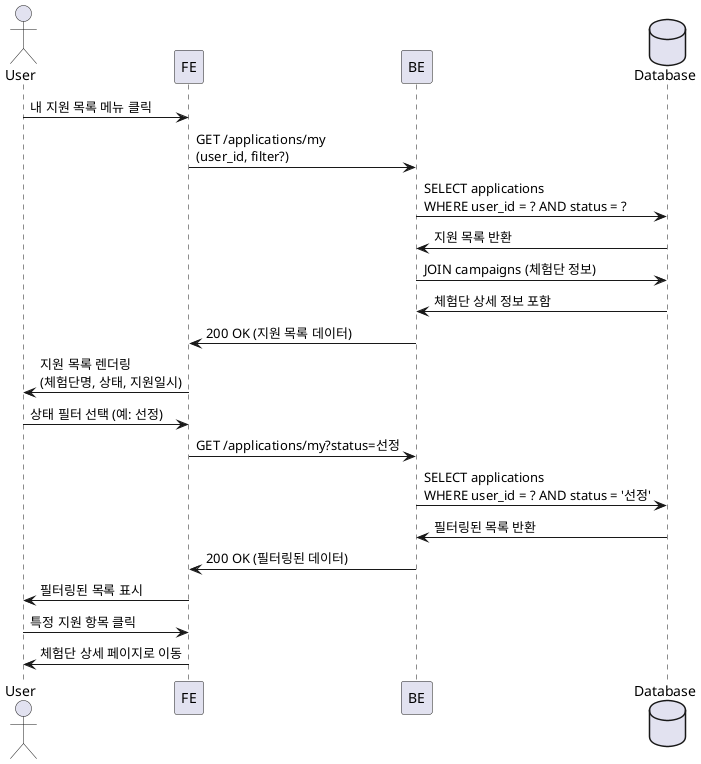

# Feature 7: 내 지원 목록 (인플루언서 전용)

## Primary Actor
인플루언서 (Influencer)

## Precondition
- 인플루언서로 로그인된 상태
- 인플루언서 정보 등록 완료
- 하나 이상의 체험단에 지원한 이력 (선택적)

## Trigger
사용자가 내비게이션 메뉴에서 "내 지원 목록" 메뉴를 클릭

## Main Scenario
1. 사용자가 메뉴에서 "내 지원 목록" 클릭
2. FE에서 BE로 지원 목록 조회 요청 (user_id 포함)
3. BE에서 현재 사용자의 모든 지원 내역 조회 (`applications` 테이블)
4. 체험단 정보와 조인하여 상세 정보 포함 (체험단명, 모집 상태, 지원 상태 등)
5. 지원 목록을 최신순으로 정렬하여 반환
6. FE에서 지원 목록 렌더링:
   - 체험단명
   - 지원 일시
   - 지원 상태 (신청완료 / 선정 / 반려)
   - 각오 한마디 (요약)
   - 방문 예정일자
7. 사용자가 상태 필터 선택 가능 (전체 / 신청완료 / 선정 / 반려)
8. 필터 선택 시 FE에서 필터링 적용 또는 BE로 재조회 요청
9. 필터된 목록 표시
10. 각 항목 클릭 시 해당 체험단 상세 페이지로 이동

## Edge Cases
- **지원 내역 없음**: 지원한 체험단이 없을 경우 "아직 지원한 체험단이 없습니다" 안내 메시지 표시
- **필터 결과 없음**: 특정 상태 필터 적용 시 해당 상태의 지원이 없으면 "해당 상태의 지원 내역이 없습니다" 표시
- **권한 없음**: 광고주 계정으로 접근 시 접근 거부 또는 리다이렉트
- **네트워크 오류**: 목록 로드 실패 시 재시도 버튼 제공
- **대량 데이터**: 지원 내역이 많을 경우 페이지네이션 적용

## Business Rules
- 본인이 지원한 내역만 조회 가능 (다른 사용자 지원 내역 조회 불가)
- 지원 상태는 "신청완료", "선정", "반려" 3가지
- 지원 목록은 최신순 정렬 (지원 일시 기준 내림차순)
- 지원 취소 기능은 별도 제공하지 않음 (현재 범위 외)
- 페이지당 20개 항목 표시 (페이지네이션)

## Sequence Diagram

