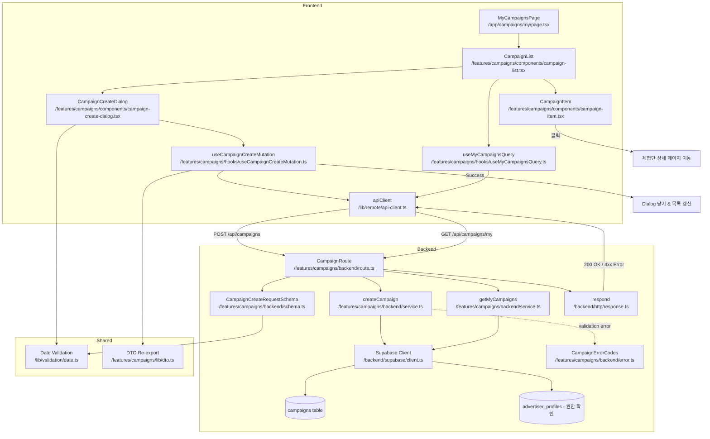

# UC-008: 광고주 체험단 관리 - 모듈화 설계

## 개요

### 필요 모듈 목록

#### Backend Layer

1. **src/features/campaigns/backend/schema.ts**
   - 체험단 생성/조회 요청/응답 Zod 스키마 정의
   - CampaignCreateRequestSchema, CampaignCreateResponseSchema
   - CampaignListQuerySchema, CampaignListResponseSchema
   - CampaignItemSchema

2. **src/features/campaigns/backend/error.ts**
   - 체험단 관리 관련 에러 코드 정의
   - INVALID_DATE_RANGE, UNVERIFIED_ADVERTISER 등

3. **src/features/campaigns/backend/validation.ts**
   - 모집 기간 유효성 검증 함수
   - 날짜 범위 검증 (시작일 < 종료일, 최소 1일)

4. **src/features/campaigns/backend/service.ts**
   - createCampaign: campaigns 테이블에 INSERT
   - getMyCampaigns: 광고주의 체험단 목록 조회
   - 광고주 권한 검증, 필드 유효성 검사

5. **src/features/campaigns/backend/route.ts**
   - POST /api/campaigns 엔드포인트 (체험단 생성)
   - GET /api/campaigns/my 엔드포인트 (내 체험단 목록 조회)

#### Frontend Layer

6. **src/features/campaigns/components/campaign-create-dialog.tsx**
   - Dialog 형태의 체험단 등록 폼
   - react-hook-form + zod 기반 폼 유효성 검사
   - 체험단명, 모집 인원, 모집 기간, 혜택, 미션, 매장 정보 입력

7. **src/features/campaigns/components/campaign-list.tsx**
   - 내 체험단 목록 UI 컴포넌트
   - CampaignItem 카드 렌더링

8. **src/features/campaigns/components/campaign-item.tsx**
   - 체험단 카드 컴포넌트
   - 체험단명, 모집 상태, 모집 인원, 신청 인원, 등록일 표시

9. **src/features/campaigns/hooks/useCampaignCreateMutation.ts**
   - React Query useMutation 훅
   - POST /api/campaigns 호출

10. **src/features/campaigns/hooks/useMyCampaignsQuery.ts**
    - React Query useQuery 훅
    - GET /api/campaigns/my 호출

11. **src/features/campaigns/lib/dto.ts**
    - Backend schema 재노출

12. **src/features/campaigns/lib/validation.ts**
    - 프론트엔드 필드 유효성 검증 함수

#### Page Layer

13. **src/app/campaigns/my/page.tsx**
    - 체험단 관리 페이지
    - CampaignList 컴포넌트 통합
    - 광고주 권한 체크

---

## Diagram



---

## Implementation Plan

### 1. Backend Schema (`src/features/campaigns/backend/schema.ts`)

#### 구현 내용
- **CampaignCreateRequestSchema**: 체험단 생성 요청 스키마
  - title: string (3~100자)
  - recruitment_start: string (YYYY-MM-DD HH:mm)
  - recruitment_end: string (YYYY-MM-DD HH:mm)
  - max_participants: number (최소 1)
  - benefits: string (10~2000자)
  - mission: string (10~2000자)
  - store_info: string (주소, 연락처 등)
  - category?: string (선택적)

- **CampaignCreateResponseSchema**: 체험단 생성 응답 스키마
  - campaign_id: UUID
  - advertiser_id: UUID
  - title: string
  - status: 'recruiting' (기본값)
  - created_at: string

- **CampaignItemSchema**: 체험단 항목 정보
  - id: UUID
  - title: string
  - status: 'recruiting' | 'closed' | 'completed'
  - max_participants: number
  - applicant_count: number (신청 인원)
  - recruitment_end: string
  - created_at: string

- **CampaignListResponseSchema**: 목록 조회 응답
  - campaigns: CampaignItemSchema[]
  - total: number

#### Unit Test Cases
```typescript
describe('CampaignCreateRequestSchema', () => {
  it('유효한 체험단 생성 요청을 파싱한다', () => {
    const input = {
      title: '블로그 체험단 모집',
      recruitment_start: '2025-01-10 00:00',
      recruitment_end: '2025-01-20 23:59',
      max_participants: 10,
      benefits: '무료 제품 제공 및 원고료 10만원',
      mission: '방문 후 7일 이내 블로그 리뷰 작성',
      store_info: '서울시 강남구 테헤란로 123, 02-1234-5678',
    };
    const result = CampaignCreateRequestSchema.safeParse(input);
    expect(result.success).toBe(true);
  });

  it('체험단명이 3자 미만이면 실패한다', () => {
    const input = { ...validInput, title: 'AB' };
    const result = CampaignCreateRequestSchema.safeParse(input);
    expect(result.success).toBe(false);
  });

  it('모집 인원이 0 이하면 실패한다', () => {
    const input = { ...validInput, max_participants: 0 };
    const result = CampaignCreateRequestSchema.safeParse(input);
    expect(result.success).toBe(false);
  });

  it('종료일이 시작일보다 빠르면 실패한다', () => {
    const input = {
      ...validInput,
      recruitment_start: '2025-01-20 00:00',
      recruitment_end: '2025-01-10 23:59',
    };
    const result = CampaignCreateRequestSchema.safeParse(input);
    expect(result.success).toBe(false);
  });
});
```

---

### 2. Backend Error Codes (`src/features/campaigns/backend/error.ts`)

#### 구현 내용
```typescript
export const campaignErrorCodes = {
  invalidDateRange: 'INVALID_DATE_RANGE',
  pastStartDate: 'PAST_START_DATE',
  unverifiedAdvertiser: 'UNVERIFIED_ADVERTISER',
  campaignNotFound: 'CAMPAIGN_NOT_FOUND',
  campaignCreationFailed: 'CAMPAIGN_CREATION_FAILED',
  validationError: 'VALIDATION_ERROR',
  unauthorizedAccess: 'UNAUTHORIZED_ACCESS',
} as const;

export type CampaignServiceError = (typeof campaignErrorCodes)[keyof typeof campaignErrorCodes];
```

---

### 3. Backend Validation (`src/features/campaigns/backend/validation.ts`)

#### 구현 내용
- **validateDateRange**: 모집 기간 유효성 검증
  - 종료일 > 시작일
  - 최소 1일 이상
- **validateStartDate**: 시작일이 과거가 아닌지 검증 (경고만, 차단 안함)

#### Unit Test Cases
```typescript
describe('validateDateRange', () => {
  it('유효한 날짜 범위면 true 반환', () => {
    const start = '2025-01-10 00:00';
    const end = '2025-01-20 23:59';
    expect(validateDateRange(start, end)).toBe(true);
  });

  it('종료일이 시작일보다 빠르면 false', () => {
    const start = '2025-01-20 00:00';
    const end = '2025-01-10 23:59';
    expect(validateDateRange(start, end)).toBe(false);
  });

  it('시작일과 종료일이 같으면 false', () => {
    const start = '2025-01-10 00:00';
    const end = '2025-01-10 00:00';
    expect(validateDateRange(start, end)).toBe(false);
  });
});
```

---

### 4. Backend Service (`src/features/campaigns/backend/service.ts`)

#### 구현 내용
- **createCampaign** 함수
  - 광고주 권한 확인 (advertiser_profiles 존재 여부 + verification_status: 'verified')
  - 필드 유효성 검사 (날짜 범위, 모집 인원, 필수값)
  - campaigns 테이블에 INSERT (status: 'recruiting')

- **getMyCampaigns** 함수
  - advertiser_id 기반 체험단 목록 조회
  - 신청 인원 COUNT 서브쿼리 (applications 테이블)
  - 최신순 정렬 (created_at DESC)

#### Unit Test Cases
```typescript
describe('createCampaign', () => {
  it('유효한 요청으로 체험단 생성 성공', async () => {
    const supabaseMock = createSupabaseMock();
    const input = {
      advertiser_id: 'advertiser-uuid',
      title: '블로그 체험단 모집',
      recruitment_start: '2025-01-10 00:00',
      recruitment_end: '2025-01-20 23:59',
      max_participants: 10,
      benefits: '무료 제품 제공',
      mission: '블로그 리뷰 작성',
      store_info: '서울시 강남구',
    };

    const result = await createCampaign(supabaseMock, input);

    expect(result.ok).toBe(true);
    expect(result.data.campaign_id).toBeDefined();
    expect(result.data.status).toBe('recruiting');
  });

  it('미검증 광고주 시 UNVERIFIED_ADVERTISER 반환', async () => {
    const supabaseMock = createSupabaseMockWithUnverifiedAdvertiser();
    const result = await createCampaign(supabaseMock, input);

    expect(result.ok).toBe(false);
    expect(result.error.code).toBe(campaignErrorCodes.unverifiedAdvertiser);
  });

  it('잘못된 날짜 범위 시 INVALID_DATE_RANGE 반환', async () => {
    const input = {
      ...validInput,
      recruitment_start: '2025-01-20 00:00',
      recruitment_end: '2025-01-10 23:59',
    };
    const result = await createCampaign(createSupabaseMock(), input);

    expect(result.ok).toBe(false);
    expect(result.error.code).toBe(campaignErrorCodes.invalidDateRange);
  });
});

describe('getMyCampaigns', () => {
  it('광고주의 체험단 목록 조회 성공', async () => {
    const supabaseMock = createSupabaseMock();
    const result = await getMyCampaigns(supabaseMock, 'advertiser-uuid');

    expect(result.ok).toBe(true);
    expect(result.data.campaigns).toBeInstanceOf(Array);
    expect(result.data.total).toBeGreaterThanOrEqual(0);
  });

  it('신청 인원 COUNT 포함', async () => {
    const supabaseMock = createSupabaseMock();
    const result = await getMyCampaigns(supabaseMock, 'advertiser-uuid');

    expect(result.ok).toBe(true);
    expect(result.data.campaigns[0].applicant_count).toBeGreaterThanOrEqual(0);
  });
});
```

---

### 5. Backend Route (`src/features/campaigns/backend/route.ts`)

#### 구현 내용
- POST /api/campaigns
  - 요청 바디를 CampaignCreateRequestSchema로 파싱
  - advertiser_id를 인증 컨텍스트에서 추출
  - createCampaign 서비스 호출
  - 성공 시 201 Created + CampaignCreateResponse

- GET /api/campaigns/my
  - advertiser_id를 인증 컨텍스트에서 추출
  - getMyCampaigns 서비스 호출
  - 성공 시 200 OK + CampaignListResponse

#### Unit Test Cases (Integration Test)
```typescript
describe('POST /api/campaigns', () => {
  it('유효한 요청으로 체험단 생성 성공', async () => {
    const response = await request(app).post('/api/campaigns').send({
      title: '블로그 체험단 모집',
      recruitment_start: '2025-01-10 00:00',
      recruitment_end: '2025-01-20 23:59',
      max_participants: 10,
      benefits: '무료 제품 제공',
      mission: '블로그 리뷰 작성',
      store_info: '서울시 강남구',
    });

    expect(response.status).toBe(201);
    expect(response.body.campaign_id).toBeDefined();
  });

  it('미검증 광고주 시 403 에러 반환', async () => {
    const response = await request(app).post('/api/campaigns').send(validPayload);

    expect(response.status).toBe(403);
    expect(response.body.error.code).toBe(campaignErrorCodes.unverifiedAdvertiser);
  });
});

describe('GET /api/campaigns/my', () => {
  it('체험단 목록 조회 성공', async () => {
    const response = await request(app).get('/api/campaigns/my');

    expect(response.status).toBe(200);
    expect(response.body.campaigns).toBeInstanceOf(Array);
  });
});
```

---

### 6. Frontend Component (`src/features/campaigns/components/campaign-create-dialog.tsx`)

#### 구현 내용
- Dialog 형태의 체험단 등록 폼
- react-hook-form + zod 기반 폼
- 입력 필드:
  - title (Text Input, 3~100자)
  - recruitment_start (DateTime Picker)
  - recruitment_end (DateTime Picker)
  - max_participants (Number Input, 최소 1)
  - benefits (Textarea, 10~2000자)
  - mission (Textarea, 10~2000자)
  - store_info (Textarea)
- useCampaignCreateMutation 훅 사용

#### QA Sheet
| Test Case | Input | Expected Output | Pass/Fail |
|-----------|-------|-----------------|-----------|
| 모든 필드 유효 입력 | 유효한 체험단 정보 | 체험단 생성 성공, Dialog 닫기 | |
| 체험단명 3자 미만 | title: "AB" | "3자 이상 입력해주세요" 에러 표시 | |
| 모집 인원 0 | max_participants: 0 | "최소 1명 이상" 에러 표시 | |
| 종료일이 시작일보다 빠름 | end < start | "종료일이 시작일보다 빨라요" 에러 표시 | |
| 미검증 광고주 | verification_status: 'pending' | "사업자 정보 검증 후 등록 가능합니다" 토스트 표시 | |
| 등록 성공 | 유효한 입력 | Dialog 닫기, 목록 갱신, 성공 토스트 | |

---

### 7. Frontend Component (`src/features/campaigns/components/campaign-list.tsx`)

#### 구현 내용
- 체험단 목록 표시
- CampaignItem 컴포넌트 반복 렌더링
- useMyCampaignsQuery 훅 사용
- "신규 체험단 등록" 버튼 (CampaignCreateDialog 트리거)
- 로딩 상태, 에러 상태, 빈 상태 처리

#### QA Sheet
| Test Case | Condition | Expected Behavior | Pass/Fail |
|-----------|-----------|-------------------|-----------|
| 체험단 있음 | campaigns.length > 0 | 체험단 목록 렌더링 | |
| 체험단 없음 | campaigns.length === 0 | "등록된 체험단이 없습니다" 안내, 등록 버튼 강조 | |
| 신규 등록 버튼 클릭 | - | CampaignCreateDialog 표시 | |
| 로딩 중 | isLoading: true | 스켈레톤 로더 표시 | |

---

### 8. Frontend Component (`src/features/campaigns/components/campaign-item.tsx`)

#### 구현 내용
- 체험단 카드
- 표시 정보:
  - 체험단명 (title)
  - 모집 상태 (Badge: 모집중 / 모집종료 / 선정완료)
  - 모집 인원 / 신청 인원 (10명 / 15명 신청)
  - 모집 종료일 (recruitment_end)
  - 등록일 (created_at)
- 클릭 시 체험단 상세 페이지로 이동

#### QA Sheet
| Test Case | Condition | Expected Behavior | Pass/Fail |
|-----------|-----------|-------------------|-----------|
| 모집중 상태 | status: "recruiting" | 파란색 "모집중" 배지 표시 | |
| 모집종료 상태 | status: "closed" | 회색 "모집종료" 배지 표시 | |
| 선정완료 상태 | status: "completed" | 녹색 "선정완료" 배지 표시 | |
| 신청 인원 표시 | applicant_count: 15 | "10명 / 15명 신청" 표시 | |
| 카드 클릭 | - | 체험단 상세 페이지로 이동 | |

---

### 9-12. Frontend Hooks & DTO

#### useCampaignCreateMutation
- POST /api/campaigns 호출
- onSuccess: Dialog 닫기, 목록 갱신, 성공 토스트

#### useMyCampaignsQuery
- GET /api/campaigns/my 호출
- queryKey: ['campaigns', 'my']

#### DTO
- Backend schema 재노출

---

### 13. My Campaigns Page (`src/app/campaigns/my/page.tsx`)

#### 구현 내용
- CampaignList 컴포넌트 통합
- useCurrentUser 훅으로 인증 상태 확인
- 광고주 역할이 아니면 접근 불가

#### QA Sheet
| Test Case | Condition | Expected Behavior | Pass/Fail |
|-----------|-----------|-------------------|-----------|
| 비인증 사용자 | isAuthenticated: false | 로그인 페이지로 리다이렉트 | |
| 인플루언서 역할 | role: 'influencer' | 403 에러 또는 접근 거부 | |
| 광고주 역할 | role: 'advertiser' | CampaignList 렌더링 | |

---

## 구현 순서

1. Backend Schema → Error Codes → Validation → Service → Route
2. Frontend DTO (re-export)
3. Frontend Hooks (useCampaignCreateMutation, useMyCampaignsQuery)
4. Frontend Components (CampaignCreateDialog → CampaignItem → CampaignList)
5. Page Integration (campaigns/my/page.tsx)
6. Hono App Configuration (registerCampaignRoutes)

---

## 추가 고려사항

### 광고주 권한 검증
- advertiser_profiles 존재 여부 확인
- verification_status: 'verified' 확인

### 날짜 자동 조정
- 시작일이 과거인 경우 경고 표시하되 등록은 허용

### 신청 인원 실시간 업데이트
- applications 테이블 COUNT 서브쿼리
- 목록 조회 시 함께 반환

### 목록 없음 처리
- 첫 방문 사용자에게 등록 버튼 강조
- 빈 상태 일러스트레이션 제공