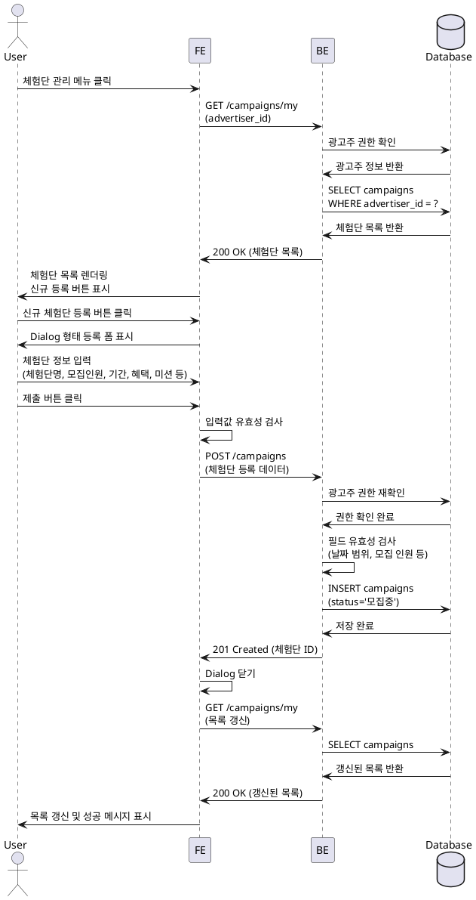

# Feature 8: 광고주 체험단 관리

## Primary Actor
광고주 (Advertiser)

## Precondition
- 광고주로 회원가입 완료
- 광고주 정보 등록 완료 (업체명, 사업자등록번호 검증 완료)
- 로그인된 상태

## Trigger
사용자가 내비게이션 메뉴에서 "체험단 관리" 메뉴를 클릭

## Main Scenario
1. 사용자가 메뉴에서 "체험단 관리" 클릭
2. FE에서 BE로 내가 등록한 체험단 목록 조회 요청 (advertiser_id)
3. BE에서 현재 광고주가 등록한 모든 체험단 조회 (`campaigns` 테이블)
4. 체험단 목록 반환 (체험단명, 모집 상태, 모집 인원, 신청 인원, 등록일 등)
5. FE에서 체험단 목록 렌더링 및 "신규 체험단 등록" 버튼 표시
6. 사용자가 "신규 체험단 등록" 버튼 클릭
7. Dialog 형태의 등록 폼 표시:
   - 체험단명
   - 모집 인원
   - 모집 기간 (시작일, 종료일)
   - 혜택 내용
   - 미션 내용
   - 매장 정보 (주소, 연락처)
   - 카테고리
8. 사용자가 정보 입력 후 "제출" 클릭
9. FE에서 입력값 유효성 검사
10. BE로 체험단 등록 요청
11. BE에서 다음 검증 수행:
    - 광고주 권한 확인
    - 필드 유효성 검사 (날짜 범위, 필수값 등)
    - 모집 인원 범위 확인 (최소 1명)
12. `campaigns` 테이블에 체험단 정보 저장 (상태: 모집중)
13. 성공 응답 반환
14. FE에서 Dialog 닫고 목록 갱신
15. 성공 메시지 표시

## Edge Cases
- **권한 없음**: 인플루언서 계정으로 접근 시 접근 거부 또는 리다이렉트
- **미검증 광고주**: 사업자등록번호 검증이 완료되지 않은 경우 "사업자 정보 검증 후 등록 가능합니다" 안내
- **필수 입력값 누락**: 필수 필드 미입력 시 "필수 입력 항목입니다" 경고
- **잘못된 날짜 범위**: 종료일이 시작일보다 빠른 경우 유효성 검사 실패
- **과거 날짜**: 모집 시작일이 과거인 경우 경고 또는 자동 조정
- **네트워크 오류**: 등록 중 오류 발생 시 재시도 안내
- **목록 없음**: 등록한 체험단이 없을 경우 "등록된 체험단이 없습니다" 안내 및 등록 버튼 강조

## Business Rules
- 광고주만 체험단 등록 가능 (인플루언서 접근 불가)
- 신규 등록 시 기본 상태는 "모집중"
- 모집 인원은 최소 1명 이상
- 모집 기간은 최소 1일 이상
- 체험단명은 3~100자 제한
- 혜택 및 미션 내용은 10~2000자 제한
- 하나의 광고주가 동시에 등록 가능한 체험단 개수는 제한 없음 (추후 제한 가능)
- 등록 후 수정 기능은 별도 제공 (현재 범위 외)

## Sequence Diagram

