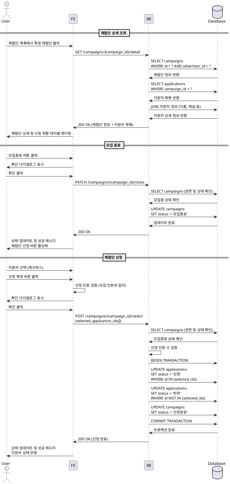

# Feature 9: 광고주 체험단 상세 & 모집 관리

## Primary Actor
광고주 (Advertiser)

## Precondition
- 광고주로 로그인된 상태
- 본인이 등록한 체험단이 하나 이상 존재
- 체험단 관리 페이지에서 특정 체험단 선택

## Trigger
사용자가 체험단 관리 목록에서 특정 체험단 카드를 클릭하여 상세 페이지 진입

## Main Scenario

### 9-1. 체험단 상세 조회 & 지원자 관리
1. 사용자가 체험단 목록에서 특정 체험단 클릭
2. FE에서 BE로 체험단 상세 조회 요청 (campaign_id)
3. BE에서 체험단 정보 조회 및 권한 확인 (본인이 등록한 체험단인지)
4. 해당 체험단에 지원한 지원자 목록 조회 (`applications` 테이블)
5. 지원자 정보와 조인 (이름, 채널 정보, 지원 일시, 각오 한마디, 방문 예정일자 등)
6. FE에서 체험단 상세 정보 및 신청 현황 테이블 렌더링:
   - 체험단 기본 정보 (체험단명, 모집 인원, 현재 신청 인원, 상태)
   - 지원자 목록 테이블 (지원자명, 채널 정보, 지원일시, 상태)
   - 상태에 따른 액션 버튼 표시 ("모집종료" 또는 "체험단 선정")

### 9-2. 모집 종료
1. 사용자가 "모집종료" 버튼 클릭
2. 확인 다이얼로그 표시 ("모집을 종료하시겠습니까?")
3. 사용자가 확인 클릭
4. FE에서 BE로 모집 종료 요청 (campaign_id)
5. BE에서 권한 확인 및 현재 상태 검증 (모집중 상태인지)
6. `campaigns` 테이블의 상태를 "모집중" → "모집종료"로 변경
7. 성공 응답 반환
8. FE에서 상태 업데이트 및 "체험단 선정" 버튼 활성화
9. 성공 메시지 표시

### 9-3. 체험단 선정
1. 사용자가 "체험단 선정" 버튼 클릭 (모집종료 상태에서만 가능)
2. 지원자 목록에서 선정할 인원 선택 (체크박스)
3. 선정 인원이 모집 인원과 일치하는지 확인
4. 사용자가 "선정 확정" 버튼 클릭
5. 확인 다이얼로그 표시 ("선정을 확정하시겠습니까? 확정 후 변경 불가")
6. 사용자가 확인 클릭
7. FE에서 BE로 선정 정보 전송 (campaign_id, selected_application_ids[])
8. BE에서 다음 처리 수행:
   - 권한 확인
   - 상태가 "모집종료"인지 확인
   - 선정 인원이 모집 인원과 일치하는지 검증
   - 트랜잭션 시작
   - 선정된 지원자의 `applications` 상태를 "선정"으로 변경
   - 선정되지 않은 지원자의 상태를 "반려"로 변경
   - `campaigns` 상태를 "선정완료"로 변경
   - 트랜잭션 커밋
9. 성공 응답 반환
10. FE에서 상태 업데이트 및 지원자 상태 반영
11. 성공 메시지 표시

## Edge Cases
- **권한 없음**: 다른 광고주의 체험단 접근 시 403 에러 또는 리다이렉트
- **인플루언서 접근**: 인플루언서가 광고주 관리 페이지 접근 시 거부
- **지원자 없음**: 지원자가 없을 때 모집종료 가능하지만 선정 불가 안내
- **이미 종료된 모집**: 모집종료 상태에서 모집종료 버튼 비활성화
- **선정 인원 불일치**: 선정한 인원이 모집 인원과 다를 경우 "모집 인원과 선정 인원이 일치해야 합니다" 경고
- **중복 선정**: 이미 선정완료 상태인 체험단에서 재선정 시도 시 거부
- **네트워크 오류**: 상태 변경 중 오류 발생 시 재시도 안내
- **동시성 문제**: 여러 요청이 동시에 발생할 경우 트랜잭션으로 보호

## Business Rules
- 본인이 등록한 체험단만 관리 가능
- 모집 상태 전환 순서: "모집중" → "모집종료" → "선정완료" (역방향 불가)
- 모집종료는 언제든지 가능하지만, 선정은 모집종료 상태에서만 가능
- 선정 인원은 모집 인원과 정확히 일치해야 함
- 선정 확정 후에는 변경 불가 (취소 및 재선정 불가)
- 선정된 지원자는 "선정" 상태로, 나머지는 "반려" 상태로 자동 변경
- 선정 프로세스는 트랜잭션으로 처리하여 일관성 보장
- 지원자 개인정보는 광고주에게만 제한적으로 노출 (채널 정보, 이름 등)

## Sequence Diagram

